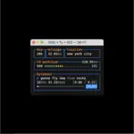

# 555 (1000 × ⁵⁄₉) NFTs

A ⁵⁄₉-themed NFT to commemorate me running 10000km in 555 days of running everyday.

$$\texttt{0x555555554F0ef522f41B2C46D941DEB4d731eB65}$$

For each token, in addition to displaying information about the day's run with a themeable color palette, the metadata of each token contains a 100% onchain-generated 24.832 second long audio of a [**5-part arrangement**](https://github.com/fiveoutofnine/555/blob/assets/8-bit-rocky.pdf) of “[**Gonna Fly Now**](https://en.wikipedia.org/wiki/Gonna_Fly_Now)” by [**Bill Conti**](https://en.wikipedia.org/wiki/Bill_Conti), popularly known as the theme song from the movie [**Rocky (1976)**](https://en.wikipedia.org/wiki/Rocky), at 117.1875 BPM.

https://github.com/fiveoutofnine/555/assets/66016924/fe3e8553-bc45-4810-92db-fce5f5437481

## Onchain audio generation

### Bytebeat generation

<details>
    <summary>Definition [<a href='https://dollchan.net/bytebeat'><i>Source</i></a>]</summary>
    <a href='http://canonical.org/~kragen/bytebeat'><b>Bytebeat</b></a> music (or one-liner music) was invented in September 2011. They're generally a piece of rhythmic and somewhat melodic music with no score, no instruments, and no real oscillators. It's simply a single-line formula that defines a waveform as a function of time, processed (usually) 8000 times per second, resulting in an audible waveform with a 256-step resolution from silence (0) to full amplitude (256). If you put that formula into a program with a loop that increments time variable (t), you can generate the headerless unsigned 8 bit mono 8kHz audio stream on output, like in this application. Since these directly output a waveform, they have great performance in compiled languages and can often be ran on even the weakest embedded devices.
    <br/>
</details>

The following is a JavaScript bytebeat format implementation for the audio in this project (24.832 second long audio of a 5-part arrangement of “Gonna Fly Now” by Bill Conti, popularly known as the theme song from the movie Rocky (1976), at 117.1875 BPM):

```js
f=(t>>10)%776,i=f>>2,v='repeat',e='charCodeAt',o=u=>1-u**2/2+u**4/24-u**6/720,T=O=>o((O%4)-2)*(((O&3)>>2)-1),F=n=>n.split``.map(x=>'1'[v]((y=x[e](0))&63)+'0'[v](y>>6)).join``,I=n=>n.split``.map(x=>String.fromCharCode((y=x[e](0))&4095)[v](y>>12)).join``,E=(x,y=0)=>.392*(t+12*T(t/1600))*2**(x/12-y)&32,((x=F(I("⁇⁃၇⁃၇⁃ぇ⁃၇⁃၇⁃ቇ၇⁃၇၃၇၃၏⁇ぃ၇ၓ၃။ၯ၃။ၯ၃။ၯ၃။ቿ⁃။⁃ቛ⁃၇၃၇၃၏灇ဠူ")))[f])*E(I("ꀵ‹䀵ꀹ‼쀹쀹ꀹ၅え큊が큅え큊が쁅恅့ဵ〷ဵ့瀹쁁⁁⁆쁅쁅聅")[e](i)-48)+(i>15&&x[f])*E(I("쀠䀠ꀵ‹䀵쀴쀴怴္〼쀹ှ぀쀵္〼쀹ှ぀쀹怹့ဵ〷ဵ့瀹䀵〴〲䀰怵")[e](i)-48)+(i>165)*E('579:<>@ACEFGIKLN'[e]((f>>1)-332)-48)+(i>173)*E(21)+(F(I("ኀ⿀ၯ၏ဿ၀⁇၏⁃假၏⁃假။ぃ假။ぃ၇䁃ၛ၃၇။၇၃၇ၛ၃၇䁃၇⁃䁇ဠူ"))[f])*E(I("퀠퀠耠쁀䀺耹耹‷‵䀷⁁⁂⁃‷‹‷䀹⁃⁄⁅‹‷‵〷ှ၁ှ⁂⁃‷‹‷〹၀၃၀⁄၅၀္ဵ耷耹逺䁆〺‹恅쀹쀹")[e](i)-48,2)+F(I("ᾀ⽀၏ဠၟ큏恏቏⁃၇၃၇၃၏ぇ၃။၇၃ဠဴ"))[f]*E(I("퀠퀠퀠瀠䁆쁅䁅쁆䁆쁈䁈쁆䁆쁈䁈聊聈ꁊ큈큈쁈")[e](i)-48,2)+(i>58&&i<178&&F(`CŃŃŃ${'ʃÀʃӀʃÀ'[v](6)}ŃŃŃŃŃŃʃÀ`)[f-236])*((2e11*(t/(1<<14))**2)&255)/5
```

[_Visualizer_](https://dollchan.net/bytebeat/#v3b64dVRfSxtBEP8uoeZ2L5fkbi9/VHJHRUyRlgqtbyok2NimaBI0SkSE2cZo1EIe+uhD8w0qxSCRVh9KX3ztJ7g/jakk36GzZ6Knttww+5u52ZnZmWG2AovFN7nAeGDJIGXT1FQ6kkwmlLyxZJpM2TCk1Vwply1LSs6QFt9lVyfRegLForFumFp4XZZZlIXwiEVZTIiJaJKpyqwxY5hFQmZGYjTMqEwQBnWKPmlYo0raKBhmIbJWWs6XM5nISrZEKoYpadLcxgIhm0ZlLrdAVEqDCZ2GJNVTb5pmgtLI+2K+kMko0//08Lq8mi+8jSytFlcmB8necxdTx+J04Exjd96mDFJRNg2VGmZEH2MyKYc0Js+SclRLqHhRZrJMKlGNhTdpUGcKwWBpMk3mAzbfs3nV8nHnkcba37sVrTvewLvOQPzkaQ4t/uW/YP/C83DoOTx67O0KATQtOJ4PUErnlhaoPOWleA0tG9outK6hbcO3HrSREFu85vB6nx84/GPfh3u81uE1C04taDkeR3yFtzi3Be2iAVKX1zCSqGyehmOjNETyphYPBiu+0D1outC8TaAHJ0gdOLGg7XiZWHDucOiJEA807Y7AD3NwhXjiwFcXjjvQepxAIi5iS/Hk2HjKfDoxOZV+Nv38xUtJmBGcaY2GdZ3d2Sd1Yc80lG4aah2AfQFe2RsWXFgcbFFhbFb19z1w6PgAdsEV/GjYkUNfdwZKdzgPrr9Tvmr1oYnUhWaPgwtnXWh3RcdObWi5yEXtP+B1TyP0LnIU+Y7Na/bQ0qvWucU58gf2jug5eMngo3aw/0IUZW514RRj/YEzl+86cIb2OAI3k+KvscJoaFCmc7C/g1ejpsU/93mjg3i/8XgunQEYVkS8/GTw8nsPR7rCefHmyxUjtuvhusvrftzlB11ev+YHfTGw+Kv+MEPsa3w0GMyntCQeaZKZ/FkV35Mt6bL6Ay6rv0Cc3lZJ0O2bnzef0GcwszDTEwtibbGcpuE6iBItldJiuAlkRoMsHqfReEAJrGVXSsu5V9kyblCdqaq6/Rc)

### Generating the audio

The audio file for this project has a sample rate of 32000Hz, and each loop is $776\cdot2^{10}$ samples long, so to generate the audio file, compute the value returned by the expression for $\texttt{t}\in[0, 776\cdot2^{10}-1]$ (you can query any $\texttt{t}$, but this is what's outputted by this project). Then, concatenate the results and prefix it with a [**WAVE file header**](http://soundfile.sapp.org/doc/WaveFormat/).

For practicality, the metadata returned by `tokenURI` accomplishes [**this with JavaScript**](https://github.com/fiveoutofnine/555/blob/797d9ef2890061c1c52c20acb094c9c28e17b017/src/utils/FiveFiveFiveArt.sol#L205-L231), but the same result can be yielded directly from the smart contract via [`getSoundValueAt(uint256 _tick)`](https://github.com/fiveoutofnine/555/blob/797d9ef2890061c1c52c20acb094c9c28e17b017/src/utils/FiveFiveFiveAudio.sol#L183) and [`getAudioFileWavHeader()`](https://github.com/fiveoutofnine/555/blob/797d9ef2890061c1c52c20acb094c9c28e17b017/src/utils/FiveFiveFiveAudio.sol#L152).

This repo provides a Foundry script [`GenerateAudioOutputScript`](https://github.com/fiveoutofnine/555/blob/main/script/GenerateAudioOutput.s.sol) to generate and write the audio file to `./output/wav/rocky.wav`. To run the script, run the following command:

```sh
forge script script/GenerateAudioOutput.s.sol:GenerateAudioOutputScript --via-ir --memory-limit="50000000000"
```

You can listen to the generated output [here](https://github.com/fiveoutofnine/555/blob/main/assets/rocky.wav).

## Deployment

The [`FiveFiveFive`](https://github.com/fiveoutofnine/555/blob/main/src/FiveFiveFive.sol) deployment requires the public libraries [`FiveFiveFiveConstants`](https://github.com/fiveoutofnine/555/blob/main/src/utils/FiveFiveFiveConstants.sol) and [`FiveFiveFiveArt`](https://github.com/fiveoutofnine/555/blob/main/src/utils/FiveFiveFiveArt.sol) to be deployed to avoid the [**Spurious Dragon code size limit**](https://github.com/ethereum/EIPs/blob/28ebf81e51136a823eef5044862f946d8de9b723/EIPS/eip-170.md).

All 3 contracts were compiled with the compiler version `v0.8.21+commit.d9974bed` with `55_555_555` optimizer runs and `via-ir=true`, and they were all deployed on [**Base**](https://base.org) by [`fiveoutofnine.eth`](https://basescan.org/address/0xA85572Cd96f1643458f17340b6f0D6549Af482F5) through the `ImmutableCreate2Factory` at[`0x0000000000FFe8B47B3e2130213B802212439497`](https://basescan.org/address/0x0000000000FFe8B47B3e2130213B802212439497):

### `FiveFiveFive`

`FiveFiveFive` was deployed to [`0x555555554F0ef522f41B2C46D941DEB4d731eB65`](https://basescan.org/address/0x555555554F0ef522f41B2C46D941DEB4d731eB65) with the salt

```
0xa85572cd96f1643458f17340b6f0d6549af482f5e2cfb88de1ab65fff1bb9fa8
```

and the bytecode

```
0x6080346200149a576040906001600160401b03908083018281118282101762001484578352601781526020917f35353520283130303020c39720e281b5e28184e28289290000000000000000008383015283519084820182811082821117620014845785526003938483526235353560e81b8184015283519180831162001484576000938454936001968786811c9616801562001479575b8587101462001465578190601f9687811162001412575b508590878311600114620013af578892620013a3575b5050600019828a1b1c191690871b1785555b80519182116200138f5785548681811c9116801562001384575b8482101462001370579081858493116200131d575b508390858311600114620012ba578692620012ae575b505060001982881b1c191690851b1784555b73a85572cd96f1643458f17340b6f0d6549af482f59360018060a01b0319918583600654161760065585857f8be0079c531659141344cd1fd0a4f28419497f9722a3daafe3b4186f6b6457e08180a360356008558185526002808252888620546001600160a01b0398919391908916620012795773afdc1a3ef3992f53c10fc798d242e15e2f0df51a958688528184528a88208381540190558288528484528a88208787825416179055827fddf252ad1be2c89b69c2b068fc378daa952ba7f163c4a11628f55a4df523b3ef9789898180a4848852898b8920541662001244578888528184528a88208381540190558488528484528a88208987825416179055848989898180a4818852898b8920541662001244578888528184528a88208381540190558188528484528a88208987825416179055818989898180a46004908189528a8c8a20541662001210578989528285528b89208481540190558189528585528b89208a88825416179055818a8a8a8180a4600589528a8c8a20541662001210578989528285528b8920848154019055600589528585528b89208a8882541617905560058a8a8a8180a4600689528a8c8a20541662001210578989528285528b8920848154019055600689528585528b89208a8882541617905560068a8a8a8180a4600789528a8c8a20541662001210578989528285528b8920848154019055600789528585528b89208a8882541617905560078a8a8a8180a4600889528a8c8a20541662001210578989528285528b8920848154019055600889528585528b89208a8882541617905560088a8a8a8180a4600989528a8c8a2054166200121057600972cda37bfc3dd20349aa901fe8646688218d8772808b528487528d8b20868154019055818b528787528d8b20818a8254161790558a8a8180a4600a89528a8c8a2054166200121057600a730734d56da60852a03e2aafae8a36ffd8c12b32f1808b528487528d8b20868154019055818b528787528d8b20818a8254161790558a8a8180a4600b89528a8c8a2054166200121057600b7316ccd2a1346978e27fdcbda43569e251c4227341808b528487528d8b20868154019055818b528787528d8b20818a8254161790558a8a8180a4600c89528a8c8a2054166200121057600c731a8906a0ebb799ed4c0e385d7493d11701700d3a808b528487528d8b20868154019055818b528787528d8b20818a8254161790558a8a8180a4600d89528a8c8a2054166200121057600d731b7688538170e98856ea86d0a68c7e407d49c5c3808b528487528d8b20868154019055818b528787528d8b20818a8254161790558a8a8180a4600e90818a528b8d8b205416620011dc57818d73230d31eec85f4063a405b0f95bde509c0d0a8b5d90818d52868952808d20888154019055828d528989528c20818b8254161790558b8b8180a4600f8a528b8d8b205416620011dc57600f8d732abc80332a8dfa064bd2f361e8b72d76ef8637c590818d52868952808d20888154019055828d528989528c20818b8254161790558b8b8180a460108a528b8d8b205416620011dc5760108d732bda41589fc6b86d17f9adb4cc90313799d5f6e590818d52868952808d20888154019055828d528989528c20818b8254161790558b8b8180a460118a528b8d8b205416620011dc5760118d73317bc38b66566566529c41462ba774f489b4a63f90818d52868952808d20888154019055828d528989528c20818b8254161790558b8b8180a460128a528b8d8b205416620011dc5760128d7334aa3f359a9d614239015126635ce7732c18fdf390818d52868952808d20888154019055828d528989528c20818b8254161790558b8b8180a460138a528b8d8b205416620011dc5760138d734a69b81a2cbeb3581c61d5087484fbda2ed3960590818d52868952808d20888154019055828d528989528c20818b8254161790558b8b8180a460148a528b8d8b205416620011dc5760148d735c227217875d0bc94aeee8798af9de3935cff0f290818d52868952808d20888154019055828d528989528c20818b8254161790558b8b8180a460158a528b8d8b205416620011dc5760158d735dffd5527551888c2ac47f799c4dc8e830decee790818d52868952808d20888154019055828d528989528c20818b8254161790558b8b8180a460168a528b8d8b205416620011dc5760168d7361e2029e46a9d2584bad8093b19bc53572e95d5d90818d52868952808d20888154019055828d528989528c20818b8254161790558b8b8180a460178a528b8d8b205416620011dc5760178d73655af72e1500eb8a8d1c90856ae3b8f148a7847190818d52868952808d20888154019055828d528989528c20818b8254161790558b8b8180a460188a528b8d8b205416620011dc5760188d7366810420d110919a0e8b550fde3fe24d50ef0e2690818d52868952808d20888154019055828d528989528c20818b8254161790558b8b8180a460198a528b8d8b205416620011dc5760198d7366bf25e328156ef5d08404094ae2532d8592f87d90818d52868952808d20888154019055828d528989528c20818b8254161790558b8b8180a4601a8a528b8d8b205416620011dc57601a8d736dacb7352b4ec1e2b979a05e3cf1f126ad64111090818d52868952808d20888154019055828d528989528c20818b8254161790558b8b8180a4601b8a528b8d8b205416620011dc57601b8d7375d4bdbf6593ed463e9625694272a0ff9a6d346f90818d52868952808d20888154019055828d528989528c20818b8254161790558b8b8180a4601c8a528b8d8b205416620011dc57601c8d7379d31bfca5fda7a4f15b36763d2e44c99d811a6c90818d52868952808d20888154019055828d528989528c20818b8254161790558b8b8180a4601d8a528b8d8b205416620011dc57601d8d737ed52863829ab99354f3a0503a622e82acd5f7d390818d52868952808d20888154019055828d528989528c20818b8254161790558b8b8180a4601e8a528b8d8b205416620011dc57601e8d73849151d7d0bf1f34b70d5cad5149d28cc2308bf190818d52868952808d20888154019055828d528989528c20818b8254161790558b8b8180a4808a528b8d8b205416620011dc577385c153aae1f101af08151863306d9e0b823ea1b5808b528487528d8b20868154019055818b528787528d8b20818a8254161790558a8a8180a48489528a8c8a205416620011a957847388f09bdc8e99272588242a808052eb32702f88d0808b528482528d8b20868154019055818b528782528d8b20818a8254161790558a8a8180a4602189528a8c8a205416620011a9576021738e10ff7d1195484a3fdd5b19d48e2f394a88fad3808b528487528d8b20868154019055818b528787528d8b20818a8254161790558a8a8180a4602289528a8c8a205416620011a9576022738fc68a56f9682312953a1730ae62afd1a99fdc4f808b528487528d8b20868154019055818b528787528d8b20818a8254161790558a8a8180a4602389528a8c8a205416620011a95760237391031dcfdea024b4d51e775486111d2b2a715871808b528487528d8b20868154019055818b528787528d8b20818a8254161790558a8a8180a46024808a528b8d8b2054166200114657808d73a35156ca4294c13fe256b10091f3d6595e3bf7d790818d52868952808d20888154019055828d528989528c20818b8254161790558b8b8180a460258a528b8d8b205416620011465760258d73b0623c91c65621df716ab8afe5f66656b21a910890818d52868952808d20888154019055828d528989528c20818b8254161790558b8b8180a460268a528b8d8b205416620011465760268d73b95777719ae59ea47a99e744afa59cdcf1c410a190818d52868952808d20888154019055828d528989528c20818b8254161790558b8b8180a460278a528b8d8b205416620011465760278d73bad58e133138549936d2576ebc33251be841d3e990818d52868952808d20888154019055828d528989528c20818b8254161790558b8b8180a460288a528b8d8b205416620011465760288d73bc955ed49f1cd4595953873bbf9b90afaf45e99690818d52868952808d20888154019055828d528989528c20818b8254161790558b8b8180a460298a528b8d8b205416620011465760298d73c95c558daa63b1a79331b2ab4a2a7af375384d3b90818d52868952808d20888154019055828d528989528c20818b8254161790558b8b8180a4602a8a528b8d8b2054166200114657602a8d73d7029bdea1c17493893aafe29aad69ef892b8ff290818d52868952808d20888154019055828d528989528c20818b8254161790558b8b8180a4602b8a528b8d8b2054166200114657602b8d73d7b8865970528b0cc372ce380d64a864039c2b9e90818d52868952808d20888154019055828d528989528c20818b8254161790558b8b8180a4602c8a528b8d8b2054166200114657602c8d73dbaacdcadd7c51a325b771ff75b261a1e7bae11c90818d52868952808d20888154019055828d528989528c20818b8254161790558b8b8180a4602d8a528b8d8b2054166200114657602d8d73dc40cbf86727093c52582405703e5b97d5c64b6690818d52868952808d20888154019055828d528989528c20818b8254161790558b8b8180a4602e8a528b8d8b2054166200114657602e8d73e340b00b6b622c136ffa5cff130ec8edcddcb39d90818d52868952808d20888154019055828d528989528c20818b8254161790558b8b8180a4602f8a528b8d8b2054166200114657602f8d73eee718c1e522ecb4b609265db7a83ab48ea0b06f90818d52868952808d20888154019055828d528989528c20818b8254161790558b8b8180a460308a528b8d8b205416620011465760308d73f196b0b975b0fd11df1936c3a35cf10ea218f28390818d52868952808d20888154019055828d528989528c20818b8254161790558b8b8180a460318a528b8d8b205416620011465760318d73f1b0e893ea21e95763577cec398ea0af5db7903790818d52868952808d20888154019055828d528989528c20818b8254161790558b8b8180a460328a528b8d8b205416620011465760328d73f2829e74c8a8709e170e21979a482f88c607b63290818d52868952808d20888154019055828d528989528c20818b8254161790558b8b8180a460338a528b8d8b205416620011465760338d73f32dd1bd55bd14d929218499a2e7d106f72f79c790818d52868952808d20888154019055828d528989528c20818b8254161790558b8b8180a460348a528b8d8b205416620011465760348d73faadaab725709f9ac6d5c03d9c6a6f5e3511fd7090818d52868952808d20888154019055828d528989528c20818b8254161790558b8b8180a4610177808b528d8b20548d166200117757734fd9d0ee6d6564e80a9ee00c0163fc952d0a45ed808c528588528e8c20805488019055818c528888528e8c2080548b16821790558b8b8180a46101cb808b528d8b20548d1662001177578b8b528487528d8b20868154019055808b528787528d8b208c8a8254161790558b8b8b8180a461022b9b8c8b528d8b205416620011465750505087875282528886209081540190558685525283868420918254161790558180a4516143119081620014a08239f35b8c5162461bcd60e51b81529283018690528201526d1053149150511657d3525395115160921b604482015260649150fd5b508c5162461bcd60e51b81529283018690528201526d1053149150511657d3525395115160921b604482015260649150fd5b8b5162461bcd60e51b815291820185905260248201526d1053149150511657d3525395115160921b604482015260649150fd5b508b5162461bcd60e51b815291820185905260248201526d1053149150511657d3525395115160921b604482015260649150fd5b8b5162461bcd60e51b8152808301869052600e60248201526d1053149150511657d3525395115160921b6044820152606490fd5b8a5162461bcd60e51b815260048101859052600e60248201526d1053149150511657d3525395115160921b6044820152606490fd5b895162461bcd60e51b815260048101849052600e60248201526d1053149150511657d3525395115160921b6044820152606490fd5b0151905038806200011b565b8787528487208894509190601f198416885b87828210620013065750508411620012ed575b505050811b0184556200012d565b0151600019838a1b60f8161c19169055388080620012df565b8385015186558b97909501949384019301620012cc565b9091508686528386208580850160051c82019286861062001366575b918991869594930160051c01915b8281106200135757505062000105565b88815585945089910162001347565b9250819262001339565b634e487b7160e01b86526022600452602486fd5b90607f1690620000f0565b634e487b7160e01b85526041600452602485fd5b015190503880620000c4565b8880528689208a94509190601f1984168a5b89828210620013fb5750508411620013e2575b505050811b018555620000d6565b0151600019838c1b60f8161c19169055388080620013d4565b8385015186558d97909501949384019301620013c1565b9091508780528588208780850160051c8201928886106200145b575b918b91869594930160051c01915b8281106200144c575050620000ae565b8a81558594508b91016200143c565b925081926200142e565b634e487b7160e01b87526022600452602487fd5b95607f169562000097565b634e487b7160e01b600052604160045260246000fd5b600080fdfe608080604052600436101561001357600080fd5b60003560e01c90816301ffc9a7146130ae5750806306fdde0314612fe6578063081812fc14612f86578063095ea7b314612e885780631249c58b14612cba57806323b872dd14612ca3578063333a700414611b7d57806342842e0e14611a8457806351cff8d9146119f957806355f804b31461178e5780636352211e146116c95780636c0360eb146115fe57806370a08231146115355780638a9aa438146111515780638da5cb5b146110ff57806395d89b4114610ff9578063a22cb46514610f2a578063b88d4fde14610dbe578063bd59342414610d1c578063c87b56dd14610804578063e7d4a5aa14610737578063e8a3d4851461025e578063e985e9c5146101dc5763f2fde38b1461012757600080fd5b346101d75760207ffffffffffffffffffffffffffffffffffffffffffffffffffffffffffffffffc3601126101d7577fffffffffffffffffffffffff000000000000000000000000000000000000000061017f613307565b6006549073ffffffffffffffffffffffffffffffffffffffff906101a682841633146133db565b169182911617600655337f8be0079c531659141344cd1fd0a4f28419497f9722a3daafe3b4186f6b6457e0600080a3005b600080fd5b346101d75760407ffffffffffffffffffffffffffffffffffffffffffffffffffffffffffffffffc3601126101d757610213613307565b61021b61332a565b9073ffffffffffffffffffffffffffffffffffffffff809116600052600560205260406000209116600052602052602060ff604060002054166040519015158152f35b346101d75760007ffffffffffffffffffffffffffffffffffffffffffffffffffffffffffffffffc3601126101d7576040516101e081019080821067ffffffffffffffff83111761070857610536916040526101a7815261056c60536020928381017f4120e281b5e28184e282892d7468656d6564204e465420746f20636f6d6d656d81527f6f72617465206d652072756e6e696e672031303030306b6d20696e203535352060408301527f64617973206f662072756e6e696e672065766572796461792e20466f7220656160608301527f636820746f6b656e2c20696e206164646974696f6e20746f20646973706c617960808301527f696e6720696e666f726d6174696f6e2061626f7574207468652064617927732060a08301527f72756e20776974682061207468656d6561626c6520636f6c6f722070616c657460c08301527f74652c20746865206d65746164617461206f66206561636820746f6b656e206360e08301527f6f6e7461696e7320612031303025206f6e636861696e2d67656e6572617465646101008301527f2032342e383332207365636f6e64206c6f6e6720617564696f206f66206120356101208301527f2d7061727420617272616e67656d656e74206f6620e2809c476f6e6e6120466c6101408301527f79204e6f77e2809d2062792042696c6c20436f6e74692c20706f70756c61726c6101608301527f79206b6e6f776e20617320746865207468656d6520736f6e672066726f6d20746101808301527f6865206d6f76696520526f636b79202831393736292c206174203131372e31386101a08301527f37352042504d2e000000000000000000000000000000000000000000000000006101c08301526040519586927f7b226e616d65223a2235353520283130303020c39720e281b5e28184e2828929878501527f222c226465736372697074696f6e223a22000000000000000000000000000000604085015251809260518501906132a1565b81017f227d0000000000000000000000000000000000000000000000000000000000006051820152036033810185520183613260565b8160609281518061060a575b5050506105f2604b60405180947f646174613a6170706c69636174696f6e2f6a736f6e3b636861727365743d7574858301527f662d383b6261736536342c00000000000000000000000000000000000000000060408301526105e2815180928786860191016132a1565b810103602b810185520183613260565b6106066040519282849384528301906132c4565b0390f35b6040517f4142434445464748494a4b4c4d4e4f505152535455565758595a616263646566601f527f6768696a6b6c6d6e6f707172737475767778797a303132333435363738392b2f603f908152938201850180516000825291965060036002808501829004811b9689880196878a01969294918a8c019160049086905b0192828451818160121c16516000538181600c1c1651600153818160061c16518a531651875360005181520191888310156106c6576004908690610687565b505095506000967f3d3d000000000000000000000000000000000000000000000000000000000000956040925201604052069004820352528252828080610578565b7f4e487b7100000000000000000000000000000000000000000000000000000000600052604160045260246000fd5b346101d75760207ffffffffffffffffffffffffffffffffffffffffffffffffffffffffffffffffc3601126101d7576101606107746004356137b3565b610802604051809262ffffff8082511683528060208301511660208401528060408301511660408401528060608301511660608401528060808301511660808401528060a08301511660a08401528060c08301511660c08401528060e08301511660e08401526101008181840151169084015261012090818301511690830152610140809101511515910152565bf35b346101d7576020807ffffffffffffffffffffffffffffffffffffffffffffffffffffffffffffffffc3601126101d757600435806000526002825273ffffffffffffffffffffffffffffffffffffffff6040600020541615610cf25760075461086c8161319b565b610b5a5750806000526009825260406000206040519061088b826131ee565b5462ffffff908181168352818160181c1685840152818160301c166040840152818160481c166060840152818160601c166080840152818160781c1660a0840152818160901c1660c0840152818160a81c1660e084015261010091808260c01c1683850152610120908260d81c168185015260ff6101409260f01c16159384158382015293610af0575b5050507fffffffffffffffffffffffffffffffffffffffffffffffffffffffffffffffff8201918211610ac157604080517fe3287ab00000000000000000000000000000000000000000000000000000000081526004810193909352815162ffffff908116602485015260208301518116604485015290820151811660648401526060820151811660848401526080820151811660a484015260a0820151811660c484015260c0820151811660e484015260e082015181166101048401526101008201518116610124840152610120820151166101448301526101400151151561016482015260008161018481733f2666d91f3047314402b8a482baaae3ffdf1b785af4908115610ab557600091610a3e575b50906106066040519282849384528301906132c4565b90503d806000833e610a508183613260565b81019082818303126101d75780519067ffffffffffffffff82116101d7570181601f820112156101d7578051610a8581613779565b92610a936040519485613260565b8184528482840101116101d757610aaf918480850191016132a1565b82610a28565b6040513d6000823e3d90fd5b7f4e487b7100000000000000000000000000000000000000000000000000000000600052601160045260246000fd5b600092935062ff63699060405194610b07866131ee565b84865262161616888701526190ff604087015262ededed606087015262a0a0a0608087015262ff8b3e908160a0880152624cc38a60c088015262f0c00060e0880152860152840152820152838080610915565b90604051907fffffffffffffffffffffffffffffffffffffffffffffffffffffffffffffffff608083019160a0840160405260008352915b0190600a90818106603001835304908115610bce577fffffffffffffffffffffffffffffffffffffffffffffffffffffffffffffffff90610b92565b90507fffffffffffffffffffffffffffffffffffffffffffffffffffffffffffffffe090608081838101940301835260405193849186600092610c108161319b565b90600190818116908115610cb55750600114610c4f575b505050610c3c8291610c4996519384916132a1565b0103908101835282613260565b906105f2565b90919692935060076000527fa66cc928b5edb82af9bd49922954155ab7b0942694bea4ce44661d9a8736c688906000915b838310610c9f57505050610c4995610c3c918501019291958891610c27565b80548a84018a0152899650918801918101610c80565b7fffffffffffffffffffffffffffffffffffffffffffffffffffffffffffffff001687850152505080151502840101915086610c49610c3c610c27565b60046040517f15893638000000000000000000000000000000000000000000000000000000008152fd5b346101d75760007ffffffffffffffffffffffffffffffffffffffffffffffffffffffffffffffffc3601126101d757610606604051610d5a81613227565b602d81527f524946462e200c0057415645666d74201000000001000100007d0000007d000060208201527f010008006461746100200c00800000000000000000000000000000000000000060408201526040519182916020835260208301906132c4565b346101d75760807ffffffffffffffffffffffffffffffffffffffffffffffffffffffffffffffffc3601126101d757610df5613307565b610dfd61332a565b6044359160643567ffffffffffffffff81116101d757610e219036906004016133ad565b92610e2d85828561350a565b803b15938415610e43575b610e41856136d5565b005b60209394506000610eb69673ffffffffffffffffffffffffffffffffffffffff9060405198899687958693857f150b7a02000000000000000000000000000000000000000000000000000000009c8d8752336004880152166024860152604485015260806064850152608484019161373a565b0393165af1918215610ab557610e41927fffffffff0000000000000000000000000000000000000000000000000000000091600091610efc575b50161482808080610e38565b610f1d915060203d8111610f23575b610f158183613260565b81019061369d565b84610ef0565b503d610f0b565b346101d75760407ffffffffffffffffffffffffffffffffffffffffffffffffffffffffffffffffc3601126101d757610f61613307565b6024358015158091036101d75733600052600560205273ffffffffffffffffffffffffffffffffffffffff60406000209216918260005260205260406000207fffffffffffffffffffffffffffffffffffffffffffffffffffffffffffffff0081541660ff83161790556040519081527f17307eab39ab6107e8899845ad3d59bd9653f200f220920489ca2b5937696c3160203392a3005b346101d75760007ffffffffffffffffffffffffffffffffffffffffffffffffffffffffffffffffc3601126101d757604051600060018281549261103c8461319b565b928383526020948582821691826000146110c1575050600114611067575b506105f292500383613260565b6000818152859250907fb10e2d527612073b26eecdfd717e6a320cf44b4afac2b0732d9fcbe2b7fa0cf65b8583106110a95750506105f293508201018561105a565b80548389018501528794508693909201918101611092565b7fffffffffffffffffffffffffffffffffffffffffffffffffffffffffffffff0016858201526105f295151560051b850101925087915061105a9050565b346101d75760007ffffffffffffffffffffffffffffffffffffffffffffffffffffffffffffffffc3601126101d757602073ffffffffffffffffffffffffffffffffffffffff60065416604051908152f35b346101d7576101607ffffffffffffffffffffffffffffffffffffffffffffffffffffffffffffffffc3601126101d75760243562ffffff811681036101d75760443562ffffff811681036101d75760643562ffffff811681036101d75760843562ffffff811681036101d75760a43562ffffff811681036101d75760c43562ffffff811681036101d75760e4359162ffffff831683036101d757610104359362ffffff851685036101d757610124359562ffffff871687036101d757610144359762ffffff891689036101d757600435600052600260205273ffffffffffffffffffffffffffffffffffffffff60406000205416330361150b57604051996112588b6131ee565b62ffffff168a5262ffffff1660208a015262ffffff16604089015262ffffff16606088015262ffffff16608087015262ffffff1660a086015262ffffff1660c085015262ffffff1660e084015262ffffff1661010083015262ffffff166101208201526101408101600190526004356000526009602052604060002090805162ffffff16918054602083015160181b65ffffff00000016604084015160301b68ffffff00000000000016606085015160481b6bffffff00000000000000000016608086015160601b6effffff0000000000000000000000001660a087015160781b71ffffff0000000000000000000000000000001660c088015160901b74ffffff000000000000000000000000000000000000169160e089015160a81b77ffffff00000000000000000000000000000000000000000016936101008a015160c01b7affffff00000000000000000000000000000000000000000000000016956101208b015160d81b7dffffff00000000000000000000000000000000000000000000000000000016978c6101408d0151151560f01b7eff000000000000000000000000000000000000000000000000000000000000169a7fff000000000000000000000000000000000000000000000000000000000000001617171717171717171717179055604051918252602081015162ffffff166020830152604081015162ffffff166040830152606081015162ffffff166060830152608081015162ffffff16608083015260a081015162ffffff1660a083015260c081015162ffffff1660c083015260e081015162ffffff1660e083015261010081015162ffffff1661010083015261012081015162ffffff166101208301526101400151151561014082015261016090206004357fff677cd17c9dbf0b85bd835daca374c944578edde9a762eab09bd9ab74c3b7c2600080a3005b60046040517f82b42900000000000000000000000000000000000000000000000000000000008152fd5b346101d75760207ffffffffffffffffffffffffffffffffffffffffffffffffffffffffffffffffc3601126101d75773ffffffffffffffffffffffffffffffffffffffff611581613307565b1680156115a05760005260036020526020604060002054604051908152f35b60646040517f08c379a000000000000000000000000000000000000000000000000000000000815260206004820152600c60248201527f5a45524f5f4144445245535300000000000000000000000000000000000000006044820152fd5b346101d75760007ffffffffffffffffffffffffffffffffffffffffffffffffffffffffffffffffc3601126101d75760405160075460008261163f8361319b565b918282526020936001908582821691826000146110c157505060011461166c57506105f292500383613260565b84915060076000527fa66cc928b5edb82af9bd49922954155ab7b0942694bea4ce44661d9a8736c688906000915b8583106116b15750506105f293508201018561105a565b8054838901850152879450869390920191810161169a565b346101d75760207ffffffffffffffffffffffffffffffffffffffffffffffffffffffffffffffffc3601126101d757600435600052600260205273ffffffffffffffffffffffffffffffffffffffff60406000205416801561173057602090604051908152f35b60646040517f08c379a000000000000000000000000000000000000000000000000000000000815260206004820152600a60248201527f4e4f545f4d494e544544000000000000000000000000000000000000000000006044820152fd5b346101d7576020807ffffffffffffffffffffffffffffffffffffffffffffffffffffffffffffffffc3601126101d75767ffffffffffffffff906004358281116101d7576117e09036906004016133ad565b91909261180673ffffffffffffffffffffffffffffffffffffffff6006541633146133db565b82116107085761181760075461319b565b601f8111611995575b506000601f83116001146118b1577f23c8c9488efebfd474e85a7956de6f39b17c7ab88502d42a623db2d8e382bbaa93836118a1926000916118a6575b508460011b907fffffffffffffffffffffffffffffffffffffffffffffffffffffffffffffffff8660031b1c1916176007555b60405193838594855284019161373a565b0390a1005b90508101358661185d565b7fffffffffffffffffffffffffffffffffffffffffffffffffffffffffffffffe083169060076000527fa66cc928b5edb82af9bd49922954155ab7b0942694bea4ce44661d9a8736c6889160005b81811061197e5750917f23c8c9488efebfd474e85a7956de6f39b17c7ab88502d42a623db2d8e382bbaa9591856118a19410611946575b5050600184811b01600755611890565b7fffffffffffffffffffffffffffffffffffffffffffffffffffffffffffffffff60f88760031b161c19908301351690558580611936565b91928460018192868a0135815501940192016118ff565b60076000527fa66cc928b5edb82af9bd49922954155ab7b0942694bea4ce44661d9a8736c688601f840160051c8101918385106119ef575b601f0160051c01905b8181106119e35750611820565b600081556001016119d6565b90915081906119cd565b346101d75760207ffffffffffffffffffffffffffffffffffffffffffffffffffffffffffffffffc3601126101d7576000808080611a35613307565b73ffffffffffffffffffffffffffffffffffffffff611a59816006541633146133db565b4791165af13d15611a7f57611a78611a703d613779565b604051613260565b156101d757005b611a78565b346101d757611a923661334d565b91611a9e83838361350a565b813b15918215611ab2575b610e41836136d5565b602091925060a473ffffffffffffffffffffffffffffffffffffffff9460006040519687948593827f150b7a0200000000000000000000000000000000000000000000000000000000998a8752336004880152166024860152604485015260806064850152826084850152165af1918215610ab557610e41927fffffffff0000000000000000000000000000000000000000000000000000000091600091611b5f575b5016148280611aa9565b611b77915060203d8111610f2357610f158183613260565b84611b55565b346101d75760207ffffffffffffffffffffffffffffffffffffffffffffffffffffffffffffffffc3601126101d757611c6f604051611bbb8161320b565b606181527ffefeeefeeefeeefefefeeefeeefeeefe00feeefeefeefffefefeeeefeffffeef60208201527ffefffffffffffeeffefffffffffffeeffefffffffffffeeffeffffffffffffff60408201527ffe00eeffeeeffffffe00eefeefeefffefefefefefefefeffffffffffffffffff60608201527fff000000000000000000000000000000000000000000000000000000000000006080820152610308620c200060043506600a1c0660031c90613954565b516001611d1e604051611c818161320b565b6061815268fffeffffffffffffff60208201527ffefffefffefffefffefffefffefffefffefffefffefffefffefffefffefffeff60408201527ffefffefffefffefffe00eefeefeefffefefefeeffefeefffffffffffffffffff60608201527fff000000000000000000000000000000000000000000000000000000000000006080820152610308620c200060043506600a1c0660031c90613954565b5160f81c6007610308620c200060043506600a1c06166007031c161515906001611df0604051611d4d8161320b565b606181526efffffffffffefffeffffffffffffff60208201527ffefefefffeeefefefefefefffeeefefefefefeffeeeefefefefefeffeeeefeee60408201527feeffffffeefeffefeefeffffffeefeeeeefeeefefefefeffffffffffffffffff60608201527fff000000000000000000000000000000000000000000000000000000000000006080820152610308620c200060043506600a1c0660031c90613954565b5160f81c6007610308620c200060043506600a1c06166007031c161515603a610308620c200060043506600a1c0660021c1180612c88575b8080612ba3575b5060018360f81c6007610308620c200060043506600a1c06166007031c161515600014612b9b57611fb3611f8e604051611e6881613243565b60c281527f05050505050505050505090905050505090909090909090909090c0c0909090960208201527f090909090909090909090909090909090909090909090909090909090909151860408201527f18181a1a1a1a1a1a1a1a1a1a1a1a1a1c1c1c151515151515151515151515151860608201527f18181a1a1a1a1a1a1a1a1a1a1a1a1a1c1c1c151515151515151515151515151560808201527f151515150705070707050709090909090909111111111111111111111111111160a08201527f161615151515151515151515151515151515151515151515151515151515151560c08201527f151500000000000000000000000000000000000000000000000000000000000060e0820152610308620c200060043506600a1c0660021c90613954565b5160f81c670de0b6b3a764000002670de0b6b3a7640000620c20006004350602613a11565b925b60f81c6007610308620c200060043506600a1c068181169091039190911c6001161515600f60029290921c91821160a6909210919091161615612b93576040518060e081011067ffffffffffffffff60e083011117610708578060e0612119920160405260a681527f080808080808080808080808080808081d1d1d1d1d1d1d1d1d1d21211d1d1d1d60208201527f1c1c1c1c1c1c1c1c1c1c1c1c1c1c1c1c1c1c1c1c1c1c1c1c1c1c1c1c1c1c212460408201527f2424212121212121212121212121262828281d1d1d1d1d1d1d1d1d1d1d1d212460608201527f242421212121212121212121212126282828212121212121212121212121212160808201527f212121211f1d1f1f1f1d1f212121212121211d1d1d1d1c1c1c1a1a1a1818181860a08201527f1d1d1d1d1d1d000000000000000000000000000000000000000000000000000060c0820152610308620c200060043506600a1c0660021c90613954565b5160f81c670de0b6b3a764000002612141670de0b6b3a7640000620c20006004350602613994565b6122096121f07fffffffffffffffffffffffffffffffffffffffffffffffffe43e9298b13800009260017ffffffffffffffffffffffffffffffffffffffffffffffffffffffffffffffffe60026003670de0b6b3a76400006121af89673782dace9d90000088060180614042565b6121b98180614042565b906121df6121d96121d36121cd8585614042565b93614256565b9361428b565b916142b3565b918303010395041611020102613fa2565b670de0b6b3a7640000620c2000600435060201926139d3565b017c7e63153c7f302f2d71f802e86a9a830cb0a6b2c040877e03184d6821586c01bc16d674ec800000000000007ffffffffffffffff5f6af8f7b3396644f18e15796000000000000000000000000787d08509902966378cdc65fee42d5fffea1580000000000000060601d6d0388eaa27412d5aca026815d636e01820260601d6d0df99ac502031bf953eff472fdcc01820260601d6d13cdffb29d51d99322bdff5f221101820260601d6d0a0f742023def783a307a986912e01820260601d6d01920d8043ca89b5239253284e4201820260601d6c0b7a86d7375468fac667a0a52701917fffffffffffffffffffffffffffffffffffffff465fda27eb4d63ded474e5f832817ffffffffffffffffffffffffffffffffffffffdc7b88c420e53a9890533129f6f817fffffffffffffffffffffffffffffffffffffff73c0c716a594e00d54e3c4cbc98180784aadc582f1d8bc491e7bc949e15040342ddc0000000000000060601d6d0139601a2efabe717e604cbb4894010260601d6d02247f7a7b6594320649aa03aba1010260601d010260601d010260601d01020105711340daa0d5f769dba1915cef59f0815a5506020160ae1d907f800000000000000000000000000000000000000000000000000000000000000081146000831216610ac1578181810205811482151715610ac15760109261242061241a670de0b6b3a76400006124259481960205614089565b91613fd8565b614042565b048060ff1c6000039081011860011c16935b15612b8b5761259961257460405161244e81613243565b60c281527f080808080808080808080808080808080808080808080808080808080808080860208201527f08080808080808080808080808082e2e2e2e2d2d2d2d2d2d2d2d2d2d2d2d2d2d60408201527f2d2d2e2e2e2e2e2e2e2e2e2e2e2e2e2e2e2e303030303030303030303030303060608201527f30302e2e2e2e2e2e2e2e2e2e2e2e2e2e2e2e303030303030303030303030303060808201527f303032323232323232323030303030303030323232323232323232323030303060a08201527f303030303030303030303030303030303030303030303030303030303030303060c08201527f303000000000000000000000000000000000000000000000000000000000000060e0820152610308620c200060043506600a1c0660021c90613954565b5160f81c670de0b6b3a764000002670de0b6b3a7640000620c20006004350602613cff565b915b15612b84576126d86125746040516125b281613243565b60c281527f080808080808080808080808080808080808080808080808080808080808080860208201527f080828282828282828282828282822222222212121212121212121212121212160408201527f21211f1f1d1d1f1f1f1f29292a2a2b2b1f1f21211f1f212121212b2b2c2c2d2d60608201527f21211f1f1d1d1f1f1f2629262a2a2b2b1f1f21211f1f212121282b282c2c2d2860808201527f211d1f1f1f1f1f1f1f1f21212121212121212222222222222222222e2e2e2e2260a08201527f222221212d2d2d2d2d2d2121212121212121212121212121212121212121212160c08201527f212100000000000000000000000000000000000000000000000000000000000060e0820152610308620c200060043506600a1c0660021c90613954565b600091612a94575b60a5610308620c200060043506600a1c0660021c1180612a79575b15612a715760405180604081011067ffffffffffffffff60408301111761070857611f8e81604061278e9301604052601081527f0507090a0c0e101113151617191b1c1e0000000000000000000000000000000060208201527ffffffffffffffffffffffffffffffffffffffffffffffffffffffffffffffeb4610308620c200060043506600a1c0660011c0190613954565b915b60ad610308620c200060043506600a1c0660021c1115612a635761282d6127c7670de0b6b3a7640000620c20006004350602613994565b60017ffffffffffffffffffffffffffffffffffffffffffffffffffffffffffffffffe60026003670de0b6b3a76400006121af7fffffffffffffffffffffffffffffffffffffffffffffffffe43e9298b1380000673782dace9d90000088060180614042565b670de0b6b3a7640000620c2000600435060201937c7e63153c7f302f2d71f802e86a9a830cb0a6b2c040877e03184d6821586c01bc16d674ec800000000000007ffffffffffffffff5f6af8f7b3396644f18e15796000000000000000000000000787d08509902966378cdc65fee42d5fffea1580000000000000060601d6d0388eaa27412d5aca026815d636e01820260601d6d0df99ac502031bf953eff472fdcc01820260601d6d13cdffb29d51d99322bdff5f221101820260601d6d0a0f742023def783a307a986912e01820260601d6d01920d8043ca89b5239253284e4201820260601d6c0b7a86d7375468fac667a0a52701917fffffffffffffffffffffffffffffffffffffff465fda27eb4d63ded474e5f832817ffffffffffffffffffffffffffffffffffffffdc7b88c420e53a9890533129f6f817fffffffffffffffffffffffffffffffffffffff73c0c716a594e00d54e3c4cbc98180784aadc582f1d8bc491e7bc949e15040342ddc0000000000000060601d6d0139601a2efabe717e604cbb4894010260601d6d02247f7a7b6594320649aa03aba1010260601d010260601d010260601d01020105711340daa0d5f769dba1915cef59f0815a5506020160ae1d966718493fba64ef00009788810298818a051490151715610ac1576010670de0b6b3a7640000612a3260ff9861242061241a8460209e05614089565b0480881c6000039081011860011c16965b8680808080806040519d169a169816951693169116010101010101168152f35b60ff93602096600096612a43565b600091612790565b5060ae610308620c200060043506600a1c0660021c106126fb565b90506903782dace9d9000000007812725dd1d243aba0e75fe645cc4873f9e65afe688c928e1f21670de0b6b3a7640000620c2000600435060211670de0b6b3a76400000215810215612b76576ec097ce7bc90715b34b9f1000000000620c20006004350602047fffffffffffffffffffffffffffffffffffffffffffffffffffffffffffffffff906c02863c1f5cdae42f95400000009080830482118102612b6857670de0b6b3a764000091020480910481118102612b685760ff670de0b6b3a76400008083600a940204041604906126e0565b63bac65e5b6000526004601cfd5b637c5f487d6000526004601cfd5b60006126d8565b60009161259b565b600093612437565b600092611fb5565b600191506007612c43604051612bb881613227565b603c81527fee0e0e0e000e0000000e000e000e0000000e000e000e0000000e000e000e000060208201527e0e000e000e0000000e000e000e0000000e000e0e0e0e0e0e0e00000000000060408201527fffffffffffffffffffffffffffffffffffffffffffffffffffffffffffffff14610308620c200060043506600a1c0601840260031c90613954565b5160f81c917fffffffffffffffffffffffffffffffffffffffffffffffffffffffffffffff14610308620c200060043506600a1c060102166007031c16151584611e2f565b5060b2610308620c200060043506600a1c0660021c10611e28565b346101d757610e41612cb43661334d565b9161350a565b60007ffffffffffffffffffffffffffffffffffffffffffffffffffffffffffffffffc3601126101d75760085461022a8111612e5e5766c55f7bc23038e33410612e345761017681148015612e29575b15612e205760ff60025b168101600855612d253315156134a5565b80600052600260205273ffffffffffffffffffffffffffffffffffffffff60406000205416612dc2573360005260036020526040600020600181540190558060005260026020526040600020337fffffffffffffffffffffffff00000000000000000000000000000000000000008254161790553360007fddf252ad1be2c89b69c2b068fc378daa952ba7f163c4a11628f55a4df523b3ef8180a4005b60646040517f08c379a000000000000000000000000000000000000000000000000000000000815260206004820152600e60248201527f414c52454144595f4d494e5445440000000000000000000000000000000000006044820152fd5b60ff6001612d14565b506101ca8114612d0a565b60046040517f356680b7000000000000000000000000000000000000000000000000000000008152fd5b60046040517ff48339e4000000000000000000000000000000000000000000000000000000008152fd5b346101d75760407ffffffffffffffffffffffffffffffffffffffffffffffffffffffffffffffffc3601126101d757612ebf613307565b6024359081600052600260205273ffffffffffffffffffffffffffffffffffffffff8060406000205416908133148015612f5d575b612efd90613440565b8360005260046020526040600020921691827fffffffffffffffffffffffff00000000000000000000000000000000000000008254161790557f8c5be1e5ebec7d5bd14f71427d1e84f3dd0314c0f7b2291e5b200ac8c7c3b925600080a4005b50816000526005602052604060002033600052602052612efd60ff604060002054169050612ef4565b346101d75760207ffffffffffffffffffffffffffffffffffffffffffffffffffffffffffffffffc3601126101d7576004356000526004602052602073ffffffffffffffffffffffffffffffffffffffff60406000205416604051908152f35b346101d75760007ffffffffffffffffffffffffffffffffffffffffffffffffffffffffffffffffc3601126101d7576040516000805490826130278361319b565b918282526020936001908582821691826000146110c157505060011461305457506105f292500383613260565b6000808052859250907f290decd9548b62a8d60345a988386fc84ba6bc95484008f6362f93160ef3e5635b8583106130965750506105f293508201018561105a565b8054838901850152879450869390920191810161307f565b346101d75760207ffffffffffffffffffffffffffffffffffffffffffffffffffffffffffffffffc3601126101d757600435907fffffffff0000000000000000000000000000000000000000000000000000000082168092036101d757817f01ffc9a70000000000000000000000000000000000000000000000000000000060209314908115613171575b8115613147575b5015158152f35b7f5b5e139f0000000000000000000000000000000000000000000000000000000091501483613140565b7f80ac58cd0000000000000000000000000000000000000000000000000000000081149150613139565b90600182811c921680156131e4575b60208310146131b557565b7f4e487b7100000000000000000000000000000000000000000000000000000000600052602260045260246000fd5b91607f16916131aa565b610160810190811067ffffffffffffffff82111761070857604052565b60a0810190811067ffffffffffffffff82111761070857604052565b6060810190811067ffffffffffffffff82111761070857604052565b610100810190811067ffffffffffffffff82111761070857604052565b90601f7fffffffffffffffffffffffffffffffffffffffffffffffffffffffffffffffe0910116810190811067ffffffffffffffff82111761070857604052565b60005b8381106132b45750506000910152565b81810151838201526020016132a4565b907fffffffffffffffffffffffffffffffffffffffffffffffffffffffffffffffe0601f602093613300815180928187528780880191016132a1565b0116010190565b6004359073ffffffffffffffffffffffffffffffffffffffff821682036101d757565b6024359073ffffffffffffffffffffffffffffffffffffffff821682036101d757565b7ffffffffffffffffffffffffffffffffffffffffffffffffffffffffffffffffc60609101126101d75773ffffffffffffffffffffffffffffffffffffffff9060043582811681036101d7579160243590811681036101d7579060443590565b9181601f840112156101d75782359167ffffffffffffffff83116101d757602083818601950101116101d757565b156133e257565b60646040517f08c379a000000000000000000000000000000000000000000000000000000000815260206004820152600c60248201527f554e415554484f52495a454400000000000000000000000000000000000000006044820152fd5b1561344757565b60646040517f08c379a000000000000000000000000000000000000000000000000000000000815260206004820152600e60248201527f4e4f545f415554484f52495a45440000000000000000000000000000000000006044820152fd5b156134ac57565b60646040517f08c379a000000000000000000000000000000000000000000000000000000000815260206004820152601160248201527f494e56414c49445f524543495049454e540000000000000000000000000000006044820152fd5b600083815260206002815273ffffffffffffffffffffffffffffffffffffffff93604090858083862054169516948503613640579061358c867fddf252ad1be2c89b69c2b068fc378daa952ba7f163c4a11628f55a4df523b3ef95949316966135748815156134a5565b863314908115613623575b811561360d575b50613440565b848352600382528083207fffffffffffffffffffffffffffffffffffffffffffffffffffffffffffffffff815401905585835280832060018154019055868352600282526004818420927fffffffffffffffffffffffff000000000000000000000000000000000000000093888582541617905552822090815416905580a4565b9050888552600484528285205416331438613586565b8786526005855283862033875285528386205460ff16915061357f565b6064838351907f08c379a00000000000000000000000000000000000000000000000000000000082526004820152600a60248201527f57524f4e475f46524f4d000000000000000000000000000000000000000000006044820152fd5b908160209103126101d757517fffffffff00000000000000000000000000000000000000000000000000000000811681036101d75790565b156136dc57565b60646040517f08c379a000000000000000000000000000000000000000000000000000000000815260206004820152601060248201527f554e534146455f524543495049454e54000000000000000000000000000000006044820152fd5b601f82602094937fffffffffffffffffffffffffffffffffffffffffffffffffffffffffffffffe0938186528686013760008582860101520116010190565b67ffffffffffffffff811161070857601f017fffffffffffffffffffffffffffffffffffffffffffffffffffffffffffffffe01660200190565b604080516137c0816131ee565b60009081815281602082015281838201528160608201528160808201528160a08201528160c08201528160e08201526101009382858301526101209083828401528361014080940152808452600260205273ffffffffffffffffffffffffffffffffffffffff85852054161561392b57835260096020528383209460ff855196613849886131ee565b5462ffffff8082168952808260181c1660208a0152808260301c16888a0152808260481c1660608a0152808260601c1660808a0152808260781c1660a08a0152808260901c1660c08a0152808260a81c1660e08a0152808260c01c16848a01528160d81c168489015260f01c16158015848801526138c957505050505090565b8495506190ff62ff636993949551966138e1886131ee565b86885262161616602089015287015262ededed606087015262a0a0a0608087015262ff8b3e908160a0880152624cc38a60c088015262f0c00060e088015286015284015282015290565b600485517f15893638000000000000000000000000000000000000000000000000000000008152fd5b908151811015613965570160200190565b7f4e487b7100000000000000000000000000000000000000000000000000000000600052603260045260246000fd5b670de0b6b3a76400006856bc75e2d631000000917812725dd1d243aba0e75fe645cc4873f9e65afe688c928e1f218111820215830215612b7657020490565b670de0b6b3a764000067a688906bd8b00000917812725dd1d243aba0e75fe645cc4873f9e65afe688c928e1f218111820215830215612b7657020490565b613a90613a1d82613994565b91613a89670de0b6b3a76400009360017ffffffffffffffffffffffffffffffffffffffffffffffffffffffffffffffffe60026003886121af7fffffffffffffffffffffffffffffffffffffffffffffffffe43e9298b1380000673782dace9d90000088060180614042565b01926139d3565b917c7e63153c7f302f2d71f802e86a9a830cb0a6b2c040877e03184d6821586c01bc16d674ec800000000000007ffffffffffffffff5f6af8f7b3396644f18e157960000000000000000000000006060917fffffffffffffffffffffffffffffffffffffff465fda27eb4d63ded474e5f832787d08509902966378cdc65fee42d5fffea15800000000000000841d6d0388eaa27412d5aca026815d636e018202841d6d0df99ac502031bf953eff472fdcc018202841d6d13cdffb29d51d99322bdff5f2211018202841d6d0a0f742023def783a307a986912e018202841d6d01920d8043ca89b5239253284e42018202841d6c0b7a86d7375468fac667a0a5270193827ffffffffffffffffffffffffffffffffffffffdc7b88c420e53a9890533129f6f817fffffffffffffffffffffffffffffffffffffff73c0c716a594e00d54e3c4cbc98180784aadc582f1d8bc491e7bc949e15040342ddc00000000000000871d6d0139601a2efabe717e604cbb48940102861d6d02247f7a7b6594320649aa03aba10102851d0102831d0102901d01020105711340daa0d5f769dba1915cef59f0815a5506020160ae1d838102906000947f8000000000000000000000000000000000000000000000000000000000000000811486831216613cd2578183051490151715613ca557829161242061241a60109695613c929405614089565b04908160ff1c90039081011860011c1690565b6024847f4e487b710000000000000000000000000000000000000000000000000000000081526011600452fd5b6024867f4e487b710000000000000000000000000000000000000000000000000000000081526011600452fd5b7fffffffffffffffffffffffffffffffffffffffffffffffffc87d253162700000613d9f613d2c83613994565b92613d98670de0b6b3a76400009460017ffffffffffffffffffffffffffffffffffffffffffffffffffffffffffffffffe60026003896121af7fffffffffffffffffffffffffffffffffffffffffffffffffe43e9298b1380000673782dace9d90000088060180614042565b01936139d3565b01917c7e63153c7f302f2d71f802e86a9a830cb0a6b2c040877e03184d6821586c01bc16d674ec800000000000007ffffffffffffffff5f6af8f7b3396644f18e157960000000000000000000000006060917fffffffffffffffffffffffffffffffffffffff465fda27eb4d63ded474e5f832787d08509902966378cdc65fee42d5fffea15800000000000000841d6d0388eaa27412d5aca026815d636e018202841d6d0df99ac502031bf953eff472fdcc018202841d6d13cdffb29d51d99322bdff5f2211018202841d6d0a0f742023def783a307a986912e018202841d6d01920d8043ca89b5239253284e42018202841d6c0b7a86d7375468fac667a0a5270193827ffffffffffffffffffffffffffffffffffffffdc7b88c420e53a9890533129f6f817fffffffffffffffffffffffffffffffffffffff73c0c716a594e00d54e3c4cbc98180784aadc582f1d8bc491e7bc949e15040342ddc00000000000000871d6d0139601a2efabe717e604cbb48940102861d6d02247f7a7b6594320649aa03aba10102851d0102831d0102901d01020105711340daa0d5f769dba1915cef59f0815a5506020160ae1d838102906000947f8000000000000000000000000000000000000000000000000000000000000000811486831216613cd2578183051490151715613ca557829161242061241a60109695613c929405614089565b67a688906bd8b0000090818102918183051490151715613fca57670de0b6b3a7640000900590565b63edcd4dd46000526004601cfd5b670570a9ec4ff40000818102917f800000000000000000000000000000000000000000000000000000000000000081147ffffffffffffffffffffffffffffffffffffffffffffffffffa8f5613b00bffff10918305141115613fca57670de0b6b3a7640000900590565b90808202917f8000000000000000000000000000000000000000000000000000000000000000821481191091818405149015171115613fca57670de0b6b3a7640000900590565b7ffffffffffffffffffffffffffffffffffffffffffffffffdc0d0570925a462d781131561425057680755bf798b4a1bf1e5811215614242576503782dace9d990604e1b0574029d9dc38563c32e5c2f6dc192ee70ef65f9978af36bb17217f7d1cf79abc9e3b3989179d835ebba824c98fb31b83b2ca45c0000000000000000000000006060916b8000000000000000000000008582851b0501831d94850290036e0587f503bb6ea29d25fcb740196450816c10fe68e7fd37d0007b713f7650810102841d936e05180bb14799ab47a8a8cb2a527d57837ffffffffffffffffffffffffffffffffffffd38dc772608b0ae56cce01296c0eb816db1bbb201f443cf962f1a1d3db4a5817fffffffffffffffffffffffffffffffffffffe5adedaa1cb095af9e4da10e363c816d0277594991cfc85f6e2461837cd9817fffffffffffffffffffffffffffffffffffffffdbf3ccf1604d263450f02a55048101028a1d0102881d0102861d0102841d0102821d01947ffffffffffffffffffffffffffffffffffffffe2c69812cf03b0763fd454a8f7e846d02d16720577bd19bf614176fe9ea830192010102901d01020105029060c3031c90565b63a37bfec96000526004601cfd5b50600090565b670de0b6b3a764000090818102918205146001161561427d57671bc16d674ec80000900590565b635c43740d6000526004601cfd5b670de0b6b3a764000090818102918205146001161561427d5768014d1120d7b1600000900590565b670de0b6b3a764000090818102918205146001161561427d5768270801d946c940000090059056fea2646970667358221220b567013f8ca19aec2ba0f6a956467ca620d7149f064e16ae02c1982ce77c310764736f6c63430008150033
```

### `FiveFiveFiveArt`

`FiveFiveFiveArt` was deployed to [`0x3f2666d91f3047314402b8A482bAaAe3fFdF1b78`](https://basescan.org/address/0x3f2666d91f3047314402b8A482bAaAe3fFdF1b78) with the salt

```
0x0000000000000000000000000000000000000000000000000000000000000000
```

and the bytecode

```
0x6080806040523461001a5761415f9081610020823930815050f35b600080fdfe600436101561000d57600080fd5b60003560e01c63e3287ab01461002257600080fd5b6101807ffffffffffffffffffffffffffffffffffffffffffffffffffffffffffffffffc360112612f2b57610160807fffffffffffffffffffffffffffffffffffffffffffffffffffffffffffffffdc360112612f2b5761024001610240811067ffffffffffffffff821117612f305760405260243562ffffff81168103612f2b576102405260443562ffffff81168103612f2b576102605260643562ffffff81168103612f2b576102805260843562ffffff81168103612f2b576102a05260a43562ffffff81168103612f2b576102c05260c43562ffffff81168103612f2b576102e05260e43562ffffff81168103612f2b57610300526101043562ffffff81168103612f2b57610320526101243562ffffff81168103612f2b57610340526101443562ffffff81169003612f2b576101443561036052610164358015159003612f2b5761016435610380526004356001810110612bbc576101866004356140be565b610191600435613734565b9060043515612fb2576004357fffffffffffffffffffffffffffffffffffffffffffffffffffffffffffffffff810111612bbc576101fb6101f57fffffffffffffffffffffffffffffffffffffffffffffffffffffffffffffffff600435016140be565b84613058565b60016004351115612fa6576004357ffffffffffffffffffffffffffffffffffffffffffffffffffffffffffffffffe810111612bbc57610268906102627ffffffffffffffffffffffffffffffffffffffffffffffffffffffffffffffffe600435016140be565b90613058565b60026004351115612f9a576004357ffffffffffffffffffffffffffffffffffffffffffffffffffffffffffffffffd810111612bbc576102cf906102627ffffffffffffffffffffffffffffffffffffffffffffffffffffffffffffffffd600435016140be565b60036004351115612f8e576004357ffffffffffffffffffffffffffffffffffffffffffffffffffffffffffffffffc810111612bbc57610336906102627ffffffffffffffffffffffffffffffffffffffffffffffffffffffffffffffffc600435016140be565b600480351115612f82576004357ffffffffffffffffffffffffffffffffffffffffffffffffffffffffffffffffb810111612bbc5761039c906102627ffffffffffffffffffffffffffffffffffffffffffffffffffffffffffffffffb600435016140be565b60056004351115612f76576004357ffffffffffffffffffffffffffffffffffffffffffffffffffffffffffffffffa810111612bbc57610403906102627ffffffffffffffffffffffffffffffffffffffffffffffffffffffffffffffffa600435016140be565b600061022052611f40811115612f6b57807fffffffffffffffffffffffffffffffffffffffffffffffffffffffffffffe0c0810111612bbc576101d37fffffffffffffffffffffffffffffffffffffffffffffffffffffffffffffe0c0820104610220525b6040519061047582612fbc565b606082526040517f7bc40c740000000000000000000000000000000000000000000000000000000081526000816004817315a6c830e04646cee9db230135fe3b1b910b4df75af4908115612f5f57600091612e67575b506105a06108d86101776108de936104ed62ffffff6020610240015116613446565b6102a0516104ff9062ffffff16613446565b6102c0516105119062ffffff16613446565b610280516105239062ffffff16613446565b6102e0516105359062ffffff16613446565b610300516105479062ffffff16613446565b9161055c62ffffff60e0610240015116613446565b9361057262ffffff610100610240015116613446565b9561058862ffffff610120610240015116613446565b9760206040519d8e8c83829e51948593019101613035565b8a016105b58251809360208085019101613035565b017f3b77696474683a32383070783b70616464696e673a30203870783b6d6172676960208201527f6e3a303b6865696768743a31383870783b646973706c61793a666c65783b7d6360408201527f6f64657b666f6e742d73697a653a313270783b6d617267696e3a6175746f7d7360608201527f70616e7b666f6e742d76617269616e742d6c69676174757265733a6e6f6e657d60808201527f2e667b636f6c6f723a230000000000000000000000000000000000000000000060a082015261068882518093602060aa85019101613035565b017f7d2e697b636f6c6f723a2300000000000000000000000000000000000000000060aa8201526106c382518093602060b585019101613035565b017f7d2e767b636f6c6f723a2300000000000000000000000000000000000000000060b58201526106fe82518093602060c085019101613035565b017f7d2e657b636f6c6f723a2300000000000000000000000000000000000000000060c082015261073982518093602060cb85019101613035565b017f7d2e6f7b636f6c6f723a2300000000000000000000000000000000000000000060cb82015261077482518093602060d685019101613035565b017f7d2e757b636f6c6f723a2300000000000000000000000000000000000000000060d68201526107af82518093602060e185019101613035565b017f7d2e747b636f6c6f723a2300000000000000000000000000000000000000000060e18201526107ea82518093602060ec85019101613035565b017f7d2e787b636f6c6f723a2300000000000000000000000000000000000000000060ec82015261082582518093602060f785019101613035565b7f7d2e797b666f6e742d66616d696c793a417d2e6e7b666f6e742d66616d696c7960f783830101527f3a427d2e7a7b706f736974696f6e3a6162736f6c7574653b6d617267696e3a6161011783830101527f75746f20303b626f726465722d7261646975733a313030253b746f703a36707861013783830101527f3b77696474683a313270783b6865696768743a313270787d3c2f7374796c653e61015783830101520103610157810184520182612ff4565b83613254565b50604051936108ec85612fbc565b6060855261090162ffffff6102405116613446565b61012052600a6004356001011015612e075760405161091f81612fd8565b601b81527f3c7370616e20636c6173733d22792069223e30303c2f7370616e3e00000000006020820152905b6109596001600435016133a3565b6101405260006101c052600a606488041015612dee57610977613065565b6101c0525b610988606488046133a3565b61020052600a606488061015612dd9576109a061309e565b6109ac606489066133a3565b91601181810311612bbc576109cb906011036109c6613065565b613522565b9360648082041015612dc3576040516109e381612fd8565b600381527fe2948000000000000000000000000000000000000000000000000000000000006020820152935b610a446064610a1f8185046133a3565b60006101a05293600a8282061015612daa57610a3961309e565b6101a0525b066133a3565b9460066102205110600014612da057610a5f610220516135d6565b90600b6102205111600014612d8b57610a766130d7565b60076102205110600014612d7557610a8c613110565b915b6006610220511180612d68575b15612d5257610220517ffffffffffffffffffffffffffffffffffffffffffffffffffffffffffffffffa810111612bbc57610afa7ffffffffffffffffffffffffffffffffffffffffffffffffffffffffffffffffa61022051016135d6565b935b600060805260116102205111600014612d3a57610b176130d7565b6080525b600060a052600d6102205110600014612d2257610b36613110565b60a0525b600c610220511180612d15575b600060e05215612cfd57610220517ffffffffffffffffffffffffffffffffffffffffffffffffffffffffffffffff4810111612bbc57610bab7ffffffffffffffffffffffffffffffffffffffffffffffffffffffffffffffff461022051016135d6565b60e0525b60006101605260176102205111600014612ce457610bcb6130d7565b610160525b60006101e05260136102205110600014612ccb57610bec613110565b6101e0525b8c6012610220511180612cbe575b60006101805215612beb5750610220517fffffffffffffffffffffffffffffffffffffffffffffffffffffffffffffffee810111612bbc577f3c7370616e20636c6173733d22792069223e6b6d3c2f7370616e3e3c2f7370616105d69a7f3c7370616e20636c6173733d22792069223e2e3c2f7370616e3e0000000000008f6119889e7f3c7370616e20636c6173733d226e2066223e00000000000000000000000000007f3c2f7370616e3e3c7370616e20636c6173733d2275223e0000000000000000009760129f9360389f946020957f3c2f7370616e3e3c7370616e20636c6173733d2274223e0000000000000000009f610d207fffffffffffffffffffffffffffffffffffffffffffffffffffffffffffffffee61022051016135d6565b610180525b61028051610d379062ffffff16613446565b6101005260405160c0527f3c646976207374796c653d226261636b67726f756e643a2300000000000000008860c0510152856101205151603881610d849160c051018c6101205101613035565b60c051019160387f3b626f726465722d7261646975733a3870783b77696474683a6669742d636f6e908401527f74656e743b6865696768743a6669742d636f6e74656e743b6f766572666c6f7760588401527f3a68696464656e3b626f726465723a31707820736f6c6964202333343334333460788401527f223e3c646976207374796c653d22706f736974696f6e3a72656c61746976653b60988401527f646973706c61793a666c65783b6865696768743a323470783b6261636b67726f60b88401527f756e643a236461646164613b70616464696e672d6c6566743a3670783b70616460d88401527f64696e672d72696768743a367078223e3c636f6465207374796c653d22666f6e60f88401527f742d66616d696c793a433b6d617267696e3a6175746f3b636f6c6f723a2334386101188401527f34383438223e3130303020c39720e281b5e28184e28289203d2035353520e2806101388401527f94203336c39731313c2f636f64653e3c646976207374796c653d226261636b676101588401527f726f756e643a236564366135653b6c6566743a3670782220636c6173733d227a6101788401527f223e3c2f6469763e3c646976207374796c653d226261636b67726f756e643a236101988401527f6635626634663b6c6566743a323270782220636c6173733d227a223e3c2f64696101b88401527f763e3c646976207374796c653d226261636b67726f756e643a233632633535356101d88401527f3b6c6566743a333870782220636c6173733d227a223e3c2f6469763e3c2f64696101f88401527f763e3c7072653e3c636f646520636c6173733d22792076223ee2948ce294803c6102188401527f7370616e20636c6173733d226e2065223e6461793c2f7370616e3ee29480e2956102388401527fa5e294803c7370616e20636c6173733d226e2065223e6d696c656167653c2f736102588401527f70616e3ee29480e295a5e294803c7370616e20636c6173733d226e2065223e6c6102788401527f6f636174696f6e3c2f7370616e3ee29480e29480e29480e29480e29480e294806102988401527fe29480e29480e29480e294900ae29482200000000000000000000000000000006102b88401526102c9926110cc825180938d8785019101613035565b01918201527f3c2f7370616e3e20e29591203c7370616e20636c6173733d226e2066223e00006102db9161014051519061110e828583018d6101405101613035565b0191820152886102f9916101c0515190611130828583018d6101c05101613035565b01610200515190611149828583018d6102005101613035565b0191820152611162825180938a61031385019101613035565b01611177825180938961031385019101613035565b8961031383830101527f6e3e20e29591203c7370616e20636c6173733d226e2066223e0000000000000061033383830101526111bf835180948961034c868601019101613035565b0101927f3c2f7370616e3e0000000000000000000000000000000000000000000000000061034c8501527fe294820ae29494e29480e29480e29480e29480e29480e295a8e29480e29480e261035361121f8351809489848a019101613035565b858301908101919091527f9480e29480e29480e29480e29480e29480e29480e295a8e29480e29480e294806103738201527fe29480e29480e29480e29480e29480e29480e29480e29480e29480e29480e2946103938201527f80e29480e29480e29480e29480e294980ae2948ce294803c7370616e20636c616103b38201527f73733d226e2065223e37643c7370616e20636c6173733d22792076223ee294806103d38201527f3c2f7370616e3e776f726b6c6f61643c2f7370616e3ee29480e29480e29480e26103f38201527f9480e29480e29480e29480e29480e29480e29480e29480e29480e294800000006104138201528251610430959093909161132d9185918801908901613035565b0101918201526113496104428d819e5194859285019101613035565b01998a015261045c986101a051519061136b828c830160206101a05101613035565b0161137f8251809360208d85019101613035565b01978801527f6e3ee29480e294900ae29482203c7370616e20636c6173733d22792066223e3061047c8801527f3830203c7370616e20636c6173733d226f223e0000000000000000000000000061049c8801526104af966113e98251809360208b85019101613035565b01958601526104c6946114058251809360208985019101613035565b016114198251809360208885019101613035565b0161142d8251809360208785019101613035565b01918201527f3c2f7370616e3e3c7370616e20636c6173733d2278223e0000000000000000006104dd91608051519061146e82858301602060805101613035565b0160a051519061148682858301602060a05101613035565b0160e051519061149e82858301602060e05101613035565b01918201526104f4906101605151906114c08284830160206101605101613035565b016101e05151906114da8284830160206101e05101613035565b016114f361018051518093830160206101805101613035565b01017f3c2f7370616e3e203139323c2f7370616e3e20e294820ae29494e29480e294806104bc8201527fe29480e29480e29480e29480e29480e29480e29480e29480e29480e29480e2946104dc8201526102917f80e29480e29480e29480e29480e29480e29480e29480e29480e29480e29480e291826104fc8201527f9480e29480e29480e29480e29480e29480e29480e29480e29480e29480e294808061051c8301527fe294980ae2948ce294803c7370616e20636c6173733d226e2065223e6279746561053c8301527f626561743c2f7370616e3ee29480e29480e29480e29480e29480e29480e2948061055c8301527fe29480e29480e29480e29480e29480e29480e29480e29480e29480e29480e29461057c8301527f80e29480e29480e29480e29480e29480e29480e29480e294900ae2948220e29661059c8301527fba203c7370616e20636c6173733d226e2066223e676f6e6e6120666c79206e6f6105bc8301527f77203c7370616e20636c6173733d22792069223e66726f6d3c2f7370616e3e206105dc8301527f726f636b793c2f7370616e3e20202020202020e294820ae29482203c7370616e6105fc8301527f20636c6173733d22792069223e3c7370616e20636c6173733d226e2066223e3361061c8301527f323c2f7370616e3e6b487a203c7370616e20636c6173733d226e2066223e333161063c8301527f3c2f7370616e3e2e3c7370616e20636c6173733d226e2066223e32353c2f737061065c8301527f616e3e6b627073202020205b3c7370616e20636c6173733d2266223e303c2f7361067c8301527f70616e3e3a3c7370616e2069643d227a2220636c6173733d2266223e30303c2f61069c8301527f7370616e3e202f203c7370616e20636c6173733d2266223e303c2f7370616e3e6106bc8301527f3a3c7370616e20636c6173733d2266223e32353c2f7370616e3e5d3c2f7370616106dc8301527f6e3e20e294820ae29482203c7370616e20636c6173733d22792069223e3c73706106fc8301527f616e2069643d2278223e3c2f7370616e3e3c7370616e20636c6173733d22662261071c8301527f3ee294813c2f7370616e3e3c7370616e2069643d2279223ee29480e29480e29461073c8301528361075c83015261077c8201527f3c2f7370616e3e3c2f7370616e3e203c7370616e2069643d22452220636c617361079c8201527f733d2279206622207374796c653d22637572736f723a706f696e7465723b62616107bc8201527f636b67726f756e643a23000000000000000000000000000000000000000000006107dc8201526101005151906118cb826107e6830160206101005101613035565b0101907f223e5b504c41595d3c2f7370616e3e20e294820ae29494e29480e29480e294806105558301527fe29480e29480e29480e29480e29480e29480e29480e29480e29480e29480e2946105758301526105958201527f9480e29480e29480e29480e29480e29480e29480e29480e29480e29480e294986105b58201527f3c2f636f64653e3c2f7072653e3c2f6469763e000000000000000000000000006105d582015260c0519003016105b6810160c051520160c051612ff4565b61199460c05184613254565b506126bc610860825192611bb46101576119b562ffffff6102405116613446565b9588517f3c2f6469763e3c2f666f726569676e4f626a6563743e3c2f7376673e000000006040519889937f3c73766720786d6c6e733d22687474703a2f2f7777772e77332e6f72672f323060208601527f30302f737667222077696474683d2235313222206865696768743d223531322260408601527f2076696577426f783d223020302035313220353132222066696c6c3d226e6f6e60608601527f65223e3c666f726569676e4f626a6563742077696474683d223531322220686560808601527f696768743d22353132223e00000000000000000000000000000000000000000060a0860152611ab181518092602060ab89019101613035565b84017f3c646976207374796c653d226261636b67726f756e643a23000000000000000060ab820152611aed82518093602060c385019101613035565b01917f3b646973706c61793a666c65783b77696474683a35313270783b68656967687460c38401527f3a35313270783b616c69676e2d6974656d733a63656e7465723b6a757374696660e38401527f792d636f6e74656e743a63656e7465723b2220786d6c6e733d22687474703a2f6101038401527f2f7777772e77332e6f72672f313939392f7868746d6c223e000000000000000061012384015261013b92611ba08251809360208785019101613035565b019182015203610137810187520185612ff4565b611bc26001600435016133a3565b905195611bd662ffffff6102405116613446565b9051906040519788937f3c68746d6c3e3c686561643e3c7469746c653e353535207c20446179202300006020860152611c19815180926020603e89019101613035565b84017f3c2f7469746c653e000000000000000000000000000000000000000000000000603e820152611c55825180936020604685019101613035565b017f3c2f686561643e3c626f6479207374796c653d2277696474683a313030253b6860468201527f65696768743a313030253b646973706c61793a666c65783b6a7573746966792d60668201527f636f6e74656e743a63656e7465723b616c69676e2d6974656d733a63656e746560868201527f723b6d617267696e3a303b6261636b67726f756e643a2300000000000000000060a6820152611d0282518093602060bd85019101613035565b017f223e00000000000000000000000000000000000000000000000000000000000060bd820152611d3d82518093602060bf85019101613035565b017f3c617564696f2069643d224e223e596f75722062726f7773657220646f65732060bf8201527f6e6f7420737570706f72742074686520617564696f20656c656d656e742e3c2f60df8201527f617564696f3e3c7363726970743e683d22223b443d22676574456c656d656e7460ff8201527f42794964223b763d22726570656174223b653d2263686172436f64654174223b61011f8201527f6f3d753d3e312d752a2a322f322b752a2a342f32342d752a2a362f3732303b5461013f8201527f3d4f3d3e6f28284f2534292d32292a2828284f2633293e3e32292d31293b463d61015f8201527f6e3d3e6e2e73706c697460602e6d617028783d3e2231225b765d2828793d785b61017f8201527f655d28302929263633292b2230225b765d28793e3e3629292e6a6f696e60603b61019f8201527f493d6e3d3e6e2e73706c697460602e6d617028783d3e537472696e672e66726f6101bf8201527f6d43686172436f64652828793d785b655d283029292634303935295b765d28796101df8201527f3e3e313229292e6a6f696e60603b473d4628492822e28187e28183e18187e2816101ff8201527f83e18187e28183e38187e28183e18187e28183e18187e28183e18987e18187e261021f8201527f8183e18187e18183e18187e18183e1818fe28187e38183e18187e18193e1818361023f8201527fe1818be181afe18183e1818be181afe18183e1818be181afe18183e1818be18961025f8201527fbfe28183e1818be28183e1899be28183e18187e18183e18187e18183e1818fe761027f8201527f8187e180a0e180b02229293b483d492822ec80a0e480a0ea80b5e280b9e480b561029f8201527fec80b4ec80b4e680b4e180b9e380bcec80b9e180bee38180ec80b5e180b9e3806102bf8201527fbcec80b9e180bee38180ec80b9e680b9e180b7e180b5e380b7e180b5e180b7e76102df8201527f80b9e480b5e380b4e380b2e480b0e680b522293b4a3d492822ea80b5e280b9e46102ff8201527f80b5ea80b9e280bcec80b9ec80b9ea80b9e18185e38188ed818ae3818ced818561031f8201527fe38188ed818ae3818cec8185e68185e180b7e180b5e380b7e180b5e180b7e78061033f8201527fb9ec8181e28181e28186ec8185ec8185e8818522293b4b3d4628492822e18a8061035f8201527fe2bf80e181afe1818fe180bfe18180e28187e1818fe28183e58187e1818fe28161037f8201527f83e58187e1818be38183e58187e1818be38183e18187e48183e1819be18183e161039f8201527f8187e1818be18187e18183e18187e1819be18183e18187e48183e18187e281836103bf8201527fe48187e180a0e180b02229293b4c3d492822ed80a0ed80a0e880a0ec8180e4806103df8201527fbae880b9e880b9e280b7e280b5e480b7e28181e28182e28183e280b7e280b9e26103ff8201527f80b7e480b9e28183e28184e28185e280b9e280b7e280b5e380b7e180bee1818161041f8201527fe180bee28182e28183e280b7e280b9e280b7e380b9e18180e18183e18180e28161043f8201527f84e18185e18180e180b9e180b5e880b7e880b9e980bae48186e380bae280b9e661045f8201527f8185ec80b9ec80b922293b4d3d4628492822e1be80e2bd80e1818fe180a0e18161047f8201527f9fed818fe6818fe1898fe28183e18187e18183e18187e18183e1818fe38187e161049f8201527f8183e1818be18187e18183e180a0e180b42229293b4e3d492822ed80a0ed80a06104bf8201527fed80a0e780a0e48186ec8185e48185ec8186e48186ec8188e48188ec8186e4816104df8201527f86ec8188e48188e8818ae88188ea818aed8188ed8188ec818822293b4f3d46286104ff8201527f6043c583c583c583247b22ca83c380ca83d380ca83c380225b765d2836297dc561051f8201527f83c583c583c583c583c583ca83c38060293b646f63756d656e745b445d28224561053f8201527f22292e6164644576656e744c697374656e65722822636c69636b222c28293d3e61055f8201527f7b673d303b636c656172496e74657276616c2868293b523d28293d3e7b7a3d5361057f8201527f7472696e67284d6174682e6d696e28672c323529293b646f63756d656e745b4461059f8201527f5d28227822292e696e6e657248544d4c3d22e29480225b765d284d6174682e6d6105bf8201527f696e28672c323429293b646f63756d656e745b445d28227922292e696e6e65726105df8201527f48544d4c3d22e29480225b765d284d6174682e6d61782832342d672c3029293b6105ff8201527f646f63756d656e745b445d28227a22292e696e6e657248544d4c3d7a2e70616461061f8201527f537461727428322c223022297d3b5228293b666f7228733d22222c743d303b7461063f8201527f3c3737362a322a2a31303b742b2b297b663d28743e3e313029253737363b693d61065f8201527f663e3e323b453d28782c793d30293d3e2e3339322a28742b31322a5428742f3161067f8201527f36303029292a322a2a28782f31322d79292633323b563d28475b665d2a45284a61069f8201527f5b655d2869292d3438292b28693e31352626475b665d292a4528485b655d28696106bf8201527f292d3438292b28693e313635292a4528223537393a3c3e404143454647494b4c6106df8201527f4e225b655d2828663e3e31292d333332292d3438292b28693e313733292a45286106ff8201527f3231292b284b5b665d292a45284c5b655d2869292d34382c32292b4d5b665d2a61071f8201527f45284e5b655d2869292d34382c32292b28693e35382626693c31373826264f5b61073f8201527f662d3233365d292a2828326531312a28742f28313c3c313429292a2a3229263261075f8201527f3535292f3529253235367c303b732b3d537472696e672e66726f6d436861724361077f8201527f6f64652856297d613d646f63756d656e745b445d28224e22293b612e7372633d61079f8201527f22646174613a617564696f2f7761763b6261736536342c556b6c4752693467446107bf8201527f41425851565a465a6d31304942414141414142414145414148304141414239416107df8201527f414142414167415a4746305951416744414341222b62746f612873293b612e706107ff8201527f6c617928293b683d736574496e74657276616c2828293d3e7b672b2b3b52282961081f8201527f7d2c31303030293b7d293c2f7363726970743e3c2f626f64793e3c2f68746d6c61083f8201527f3e0000000000000000000000000000000000000000000000000000000000000061085f82015203610840810186520184612ff4565b6126ca6001600435016133a3565b926126d7606486046133a3565b94600a606482061015612ba7576126ec61309e565b6126f8606483066133a3565b9261271961271361270d6001600435016133a3565b96613149565b91613149565b6127276001600435016133a3565b91612734606486046133a3565b96600a606487061015612b8f57606461274b61309e565b965b06612757906133a3565b966040519b8c809c602082017f7b226e616d65223a22353535207c204461792023000000000000000000000000905280516034819301916020019161279b92613035565b8c01603481017f222c226465736372697074696f6e223a22352f392072616e2000000000000000905281519182604d830191602001916127da92613035565b01957f2e000000000000000000000000000000000000000000000000000000000000009687604d82015281519182604e8301916020019161281a92613035565b0181519182604e8301916020019161283192613035565b01604e81017f6b6d206f6e20646179200000000000000000000000000000000000000000000090528151918260588301916020019161286f92613035565b01605881017f2e222c22696d6167655f64617461223a22646174613a696d6167652f7376672b9052607881017f786d6c3b636861727365743d7574662d383b6261736536342c000000000000009052815191826091830191602001916128d492613035565b01609181017f222c22616e696d6174696f6e5f75726c223a22646174613a746578742f68746d905260b181017f6c3b636861727365743d7574662d383b6261736536342c00000000000000000090528151918260c88301916020019161293992613035565b0160c881017f222c2261747472696275746573223a5b7b2274726169745f74797065223a2264905260e881017f6179222c2276616c7565223a000000000000000000000000000000000000000090528151918260f48301916020019161299e92613035565b019360f485017f7d2c7b2274726169745f74797065223a226d696c6561676520286b6d29222c22905261011485017f76616c7565223a00000000000000000000000000000000000000000000000000905261011b94815191828783019160200191612a0892613035565b019384015261011c92815191828583019160200191612a2692613035565b01815191828483019160200191612a3c92613035565b7f7d2c7b2274726169745f74797065223a226c6f636174696f6e222c2276616c759101918201527f65223a220000000000000000000000000000000000000000000000000000000061013c820152815191612aa1908390610140840190602001613035565b0161014081017f227d5d7d000000000000000000000000000000000000000000000000000000009052036101248101825261014401612ae09082612ff4565b612ae990613149565b6040518060208101927f646174613a6170706c69636174696f6e2f6a736f6e3b6261736536342c000000845280519081603d84019160200191612b2b92613035565b810103601d81018252603d01612b419082612ff4565b6040519182916020835251908160208401528160408401612b6192613035565b601f017fffffffffffffffffffffffffffffffffffffffffffffffffffffffffffffffe01681010360400190f35b6064604051612b9d81612fbc565b600081529661274d565b604051612bb381612fbc565b600081526126ec565b7f4e487b7100000000000000000000000000000000000000000000000000000000600052601160045260246000fd5b6105d69a7f3c7370616e20636c6173733d22792069223e2e3c2f7370616e3e00000000000060206119889e7f3c7370616e20636c6173733d226e2066223e00000000000000000000000000007f3c2f7370616e3e3c7370616e20636c6173733d2275223e0000000000000000009760129f9660389f977f3c7370616e20636c6173733d22792069223e6b6d3c2f7370616e3e3c2f737061987f3c2f7370616e3e3c7370616e20636c6173733d2274223e0000000000000000009f604051612cb181612fbc565b6000815261018052610d25565b5060186102205110610bff565b604051612cd781612fbc565b600081526101e052610bf1565b604051612cf081612fbc565b6000815261016052610bd0565b604051612d0981612fbc565b6000815260e052610baf565b5060126102205110610b47565b604051612d2e81612fbc565b6000815260a052610b3a565b604051612d4681612fbc565b60008152608052610b1b565b604051612d5e81612fbc565b6000815293610afc565b50600c6102205110610a9b565b604051612d8181612fbc565b6000815291610a8e565b604051612d9781612fbc565b60008152610a76565b610a5f60066135d6565b604051612db681612fbc565b600081526101a052610a3e565b604051612dcf81612fbc565b6000815293610a0f565b604051612de581612fbc565b600081526109a0565b604051612dfa81612fbc565b600081526101c05261097c565b60646004356001011015612e5257604051612e2181612fd8565b601a81527f3c7370616e20636c6173733d22792069223e303c2f7370616e3e00000000000060208201525b9061094b565b604051612e5e81612fbc565b60008152612e4c565b3d9150816000823e612e798282612ff4565b6020818381010312612f2b5780519067ffffffffffffffff8211612f2b57828101601f838301011215612f2b57818101519067ffffffffffffffff8211612f305760405193612ef060207fffffffffffffffffffffffffffffffffffffffffffffffffffffffffffffffe0601f8601160186612ff4565b8285528101602083858401010111612f2b5783612f226108d8936101779360206105a097816108de9a01920101613035565b935050506104cb565b600080fd5b7f4e487b7100000000000000000000000000000000000000000000000000000000600052604160045260246000fd5b6040513d6000823e3d90fd5b600061022052610468565b61040390600090613058565b61039c90600090613058565b61033690600090613058565b6102cf90600090613058565b61026890600090613058565b6101fb60006101f5565b6020810190811067ffffffffffffffff821117612f3057604052565b6040810190811067ffffffffffffffff821117612f3057604052565b90601f7fffffffffffffffffffffffffffffffffffffffffffffffffffffffffffffffe0910116810190811067ffffffffffffffff821117612f3057604052565b60005b8381106130485750506000910152565b8181015183820152602001613038565b91908201809211612bbc57565b6040519061307282612fd8565b600182527f20000000000000000000000000000000000000000000000000000000000000006020830152565b604051906130ab82612fd8565b600182527f30000000000000000000000000000000000000000000000000000000000000006020830152565b604051906130e482612fd8565b601282527fe296aee296aee296aee296aee296aee296ae00000000000000000000000000006020830152565b6040519061311d82612fd8565b601d82527f3c7370616e20636c6173733d2269223e2e2e2e2e2e2e3c2f7370616e3e0000006020830152565b80516060929181613158575050565b9092506003906002938285820104851b92604051957f4142434445464748494a4b4c4d4e4f505152535455565758595a616263646566601f52603f916106707f6768696a6b6c6d6e6f707172737475767778797a303132333435363738392d5f18835260208801938689019460208601956020838901019182519660048660009b8c87525b01928284518d828260121c165190538181600c1c1651600153818160061c16518b53165188538b51815201918983101561321b5760049087906131dd565b505096507f3d3d000000000000000000000000000000000000000000000000000000000000956040925201604052069004820352528252565b91909160409283519161326683612fbc565b60609283815285528094825192831561339a578251938451809101957fffffffffffffffffffffffffffffffffffffffffffffffffffffffffffffffe09384870151906605c284b9def77991828082061591040291828a1092602098888a8d84178401011691828a8c8a011694029515613325575b50505050505050811561331a575b828085845101165b808401518184890101520191821561330b579183906132f1565b50505050600090838301015252565b9450808052846132e9565b84878d969798999d1491860101865118171561337d57918893929184928651968c8801998a938901019052525b808301518a82870101520190811561336c57908290613352565b5050505293388080808080806132db565b5091989450508192868901528701019052388080808080806132db565b50909450505050565b906040517fffffffffffffffffffffffffffffffffffffffffffffffffffffffffffffffff608082019360a0830160405260008552935b0192600a90818106603001855304928315613416577fffffffffffffffffffffffffffffffffffffffffffffffffffffffffffffffff906133da565b92506080837fffffffffffffffffffffffffffffffffffffffffffffffffffffffffffffffe09203019201918252565b9060405160408101926060820160405260008452600f936f3031323334353637383961626364656685527ffffffffffffffffffffffffffffffffffffffffffffffffffffffffffffffffe603a840192915b0190858116516001830153858160041c1651825360081c908281146134de577ffffffffffffffffffffffffffffffffffffffffffffffffffffffffffffffffe90613498565b94509050613514576040837fffffffffffffffffffffffffffffffffffffffffffffffffffffffffffffffe09203019201918252565b632194895a6000526004601cfd5b805160609392909181158315171561353957505050565b604051945091602080860191905b8060005b81818801015181860152018281101561356557819061354b565b509091827fffffffffffffffffffffffffffffffffffffffffffffffffffffffffffffffff91019301938685156135a0575093929190613547565b945050505060008152037fffffffffffffffffffffffffffffffffffffffffffffffffffffffffffffffe0810183528201604052565b6040516135e281612fd8565b60038152613617826020927fe296ae000000000000000000000000000000000000000000000000000000000084820152613522565b9160060360068111612bbc576136bc926136f19261366b60379360405161363d81612fd8565b600181527f2e0000000000000000000000000000000000000000000000000000000000000084820152613522565b9060405195836136848895518092858089019101613035565b8401917f3c7370616e20636c6173733d2269223e00000000000000000000000000000000818401528351938491603085019101613035565b017f3c2f7370616e3e000000000000000000000000000000000000000000000000006030820152036017810184520182612ff4565b90565b908151811015613705570160200190565b7f4e487b7100000000000000000000000000000000000000000000000000000000600052603260045260246000fd5b604080519161014083019083821067ffffffffffffffff831117612f3057600f918352610116845260016138856020956000878201527f0111111000022222222222222222222222222222222222222222222222222222868201527f222222233333333000000000000000000000000000000000000000000400000060608201527855666666666666666666666666666666666666666660000000608082015279022222222777772222222222000000000000000000000000000060a08201527f08888889a900000000000000000000000000000bbbccc000000000000000000060c08201527b22222222222ddd22222000000000000000000000000000000000000060e08201526f0222eeeee222222222222222222222226101008201527f22222222222000000000000000000000fffffffff00000000000000000000000610120820152828401831c906136f4565b5160f81c9116613c795760ff60005b161c168015613c4b5760018114613c1d5760028114613bef5760038114613bb45760048114613b865760058114613b585760068114613b1d5760078114613ae25760088114613aa75760098114613a6c57600a8114613a3157600b81146139f657600c81146139bb57600d811461398057600e14613946577f64656e766572000000000000000000000000000000000000000000000000000090519161393983612fd8565b6006835282015290600690565b7f6b61676f7368696d61000000000000000000000000000000000000000000000090519161397383612fd8565b6009835282015290600990565b507f6a656a75000000000000000000000000000000000000000000000000000000009051916139ae83612fd8565b6004835282015290600490565b507f726564776f6f64206369747900000000000000000000000000000000000000009051916139e983612fd8565b600c835282015290600c90565b507f73636f7474732076616c6c657900000000000000000000000000000000000000905191613a2483612fd8565b600d835282015290600d90565b507f73656c666f737300000000000000000000000000000000000000000000000000905191613a5f83612fd8565b6007835282015290600790565b507f7265796b6a6176c3ad6b00000000000000000000000000000000000000000000905191613a9a83612fd8565b600a835282015290600990565b507f7061726973000000000000000000000000000000000000000000000000000000905191613ad583612fd8565b6005835282015290600590565b507f7368616e67686169000000000000000000000000000000000000000000000000905191613b1083612fd8565b6008835282015290600890565b507f6c75c5a174696361206261790000000000000000000000000000000000000000905191613b4b83612fd8565b600c835282015290600b90565b507f6d696c616e000000000000000000000000000000000000000000000000000000905191613ad583612fd8565b507f776573746d696e697374657200000000000000000000000000000000000000009051916139e983612fd8565b507f68756e74696e67746f6e20626561636800000000000000000000000000000000905191613be283612fd8565b6010835282015290601090565b507f73656f756c000000000000000000000000000000000000000000000000000000905191613ad583612fd8565b507f73616e206672616e636973636f00000000000000000000000000000000000000905191613a2483612fd8565b507f6e657720796f726b206369747900000000000000000000000000000000000000905191613a2483612fd8565b60ff6004613894565b60405190610380820182811067ffffffffffffffff821117612f305760405261034182527f5300000000000000000000000000000000000000000000000000000000000000610360837f063c96362c4257a47296539c45336306586b97517f484180f6c16f166b72e57960208201527f8f35dd7275577a3dbc6b870a642827604c916a561f76d53e5bd4c340d62a60b360408201527fec641b5b89f86681a3e98f3507756929ab286576543aa6a4518492f54dd4f96d60608201527f251757d5a17f951b4b0b749e26794f02548907a1793254bfd40f73d8cf87336a60808201527f51697b97e5ad1f58f040e85e37388c3eb79c57c7543278efa3a6412cd3ffe56360a08201527fa6a085443843e85c2a2c35feee41f64741e36f6614f1bfe4d07d760f4961128160c08201527f151470a77c65a6254e49782db7253a284735c4e12973cdc0f41f52881e47432060e08201527f439c9792f9fe769698a837096935335642879d26ec79566b38e59c2b05bf54256101008201527faa5ac7407487d33c460064278562086f74d3dc37842b45367461567c515891246101208201527f89924c33267e04f48806ab6105d273a77e89a78c4bd49146e7427817d07466d16101408201527f7213eb29c3a07ec78d68983f60941940e7584344172cc58483f7ac84b736bc576101608201527f4c7645c272547e5007433ea2e75565dd7465c32ed8b2416876ca284cc198d29f6101808201527ff8df2915157c783f5716be2cd5e841962f3ee7a17d487883e7424277ae3e547e6101a08201527f6595444691e366b4718305147733db4b18d04795337933ec62d9644c88b979576101c08201527fc68a265777962e60241581f72bb2a3b770c5787e490e43e75c99c44f7c46e4836101e08201527fe6067394c67bc5ad4f27a070760fa9a6b672546445a3abbba53472abf95c229d6102008201527f83e4836426675ff51552fab18db7dd40376d6b34c74b87284b2a2b6517cd67e86102208201527f1456e6267e25df7a365f3ecbde8e6c1d77038a8284134db9c556379154976e6a6102408201527f5b057d1672554ca851753b78e43672572a6917fd5ba7d85de79780979f5f18e16102608201527f8206086d488f4baabe8d5b6a9cf688912b187b38fc8a383abce6cc8566a58fa76102808201527ff98308189146586fa6f2c9776777876e65b89e78aa527498e577384583e822bf6102a08201527f780f78c6c78288bfa3697a9366843eeb0352a94a8688898b371865b848d0c8766102c08201527f89a6f15f378b76579e89981c7b79856f171679483a8d25b35377405b86f685e86102e08201527f936a4a5591d7e871d8407a98728ff8678ab7de8748547f17d541dc9e784819656103008201527fd70a82371d7fa72484379076f93e5ab872a4c8b7a7a8dc91585d5f0a147e16d46103208201527fbf371392aa1693e925aba9d39919399208fa7e771e7569466a66586509e58f686103408201520152565b610176811461412257600481600c020160031c9060016140fb6140e8846140e3613c82565b6136f4565b5193826140f3613c82565b9101906136f4565b51911661411257610f009060f81c9160f01c161790565b610ff09060fc1c9160f41c161790565b5061138a9056fea2646970667358221220995a81238f2e4417d652394ec51bd048925a240bcc38da979510a62f3314cfa464736f6c63430008150033
```

### `FiveFiveFiveConstants`

`FiveFiveFiveConstants` was deployed to [`0x15a6c830e04646CEe9dB230135fE3b1b910B4df7`](https://basescan.org/address/0x15a6c830e04646CEe9dB230135fE3b1b910B4df7) with the salt

```
0x0000000000000000000000000000000000000000000000000000000000000000
```

and the bytecode

```
0x6080806040523461001a576145579081610020823930815050f35b600080fdfe6080600436101561000f57600080fd5b600090813560e01c637bc40c741461002657600080fd5b817ffffffffffffffffffffffffffffffffffffffffffffffffffffffffffffffffc36011261451d5761382081019080821067ffffffffffffffff8311176144f05760409182526137e181526020907f3c7374796c653e40666f6e742d666163657b666f6e742d66616d696c793a413b828201527f7372633a75726c28646174613a666f6e742f776f6666323b7574662d383b626180848301527f736536342c643039474d67414241414141414136344142414141414141472f7760608301527f414141356141414541414141414141414141414141414141414141414141414160808301527f4141414141476859624942794a4e675a6750314e55515651754149495745516760a08301527f4b6f4553614b677542466741424e67496b41344679424341466731774849417760c08301527f48477a41586f364b63736b6f682b367544624179466d763048464b46677a467160e08301527f434974594f7974767672654363437a7844316151514f3237386d74434d7333586101008301527f61443769746630746747324531526e37463642726758574d47366747334b7a736101208301527f767137522f5a4d767a2f4f2f336135386e614b6951574438313841705a7a45716101408301527f63724e31586e7a696c6530695933516f69376e2b41594c7456614439557030336101608301527f7441784155676232684e2b6b57504d42363653556354577332632b564c7a39396101808301527f58576174775853456b787146324e746d3732392f73743970447a64456c2f68556101a08301527f576f664b5558687847495645656878414f5a566846702b7957464836524e2f566101c08301527f4146706b306d4f44315a506473416751414134794b516f526f383977414645766101e08301527f576b4f48524e42623463414377554a53364c7931474b334c4d6156476e7273536102008301527f6b5658565252644b57717145362b614b73756a524770395035684149335078366102208301527f467752666e4b787641664b6d3670677263563953714176445a616178535178676102408301527f41486836616d41466a5a697842627778737a625474625377564a634e534463376102608301527f7373336d53455052497469546c556d326444586d41426d43622b7175346168746102808301527f48584557536a506c6733573348476d756b6369546758324b4873724c7172504c6102a08301527f53494a4a68537362465441454163436f594d4e43584d543052525039715054696102c08301527f3347386c535541697a41496759587362626331634a6b676b2f535a624b472b736102e08301527f63556c41734f475163374c596f4746476a703645753759434d6c45556c4269576103008301527f685552766d684341465252734a4b474b42726d6d632b315a66413633636d416c6103208301527f53554377596875514f51576f5978717a4a6d736963636a4b38464a33624b4c696103408301527f4549656b6b51497947705553485479564b764549464a656844754646394178696103608301527f6f326d6a64783577534b49524e7a6b317550576a31744b6131744c366e464c4d6103808301527f5a4a324a4e4a7348557a70463333665945554d436942683758794678524453486103a08301527f534a38545951776857493457417a6c54766b39557776566246784343454173476103c08301527f696745674a54684f5864784d5a494a51797a574a49494251706b4a4254714f6f6103e08301527f304c392b337245564664476b7654354155794143316c4b71414a435566496b4b6104008301527f674d696c697755456d365573725a5168773671645951324764424868397468506104208301527f3850594869486a694a352f47454e35637a6941443464664d4777484356412f336104408301527f457039494f39504d46684c4b424b3757344b4a3872646a6f75426d36526471356104608301527f305833745a412f6848395a662b617744676734514b6746524256314d42444b386104808301527f4e59416b3958533174514143676839634751494d69677744394164784f4143786104a08301527f51596f494750506a334c4951557a707955703241686f69564a6b3257524a5a626104c08301527f4a563678436c567231566e645152385a52346d6a6f614f715937566a6b574f706104e08301527f346f6e4f6c4c4143516b7647537154585546594f4e46566a345658357a7131686105008301527f2f5142664c75584b733044566e316a36376262664e566c754d42764f2b3839376105208301527f7a37764e7563372f4f66547a332f747a67584438674142436b504b51353273396105408301527f72783049797841454379414c697a4a6b436f795654414841484150494d50416a6105608301527f732f62514b52456d696a41587a4d4e7433594a7a6d50394e433666575a464d776105808301527f41344e75625974364f6a7a456b7a516a305257596b37694268716939735372686105a08301527f546a41546e34566165504d4a4f78724d574356305943632f555257786a7866426105c08301527f4d616361497753574d454765456644354f6c6f412f43634e674f43664b6f7a686105e08301527f6152366d46792f55494558356f773857453752646d6e346b765a726d6d71536d6106008301527f4b77756d6536576e6c686f6b4a696b497054746a7a6b51616e694e56305751586106208301527f4e54552f7a735a4f54304e617459476431536c32336175534d7564305455666a6106408301527f74535134376b746b6e6c6832416b475649696b636839493449727359564e6c4b6106608301527f72536f7031464d644a4230694b6146706232587041514d767652735a744c52656106808301527f2f5957704b364a646e673742686b72364f68644e7551316b75484432614c6c746106a08301527f746e7149526d6b6368516e6b76422f7a5a43773869623056705749456f3662776106c08301527f6166354e694b695a56616d4266614c664268746474376152696e554a3562464d6106e08301527f675a6955494a304c45734f3262525a746e7a4e6f3572475665336a32446267696107008301527f68573233324d4c6c63712b42306c47436c6f6b41486b76537359594956566b2b6107208301527f58426a4b34567358306b414c5971346a4a6c5a5a79554a7136506c4b7546594d6107408301527f6b3953533165416e4869744358615765397136576850596b6938746830396b726107608301527f506a46772b556577797072506f7147336d7031554b546f546f4165634773744d6107808301527f736c4c643635345a4a37545131503570496539337144664d6165642f305963796107a08301527f646d6669515655782f496d6851546c2b486462704979543571463963336361556107c08301527f32304e6762784269724b4b42784c686d44516c614570416e654b46486f3832736107e08301527f57457534627a62747a6c4e63487045305335706737306e3458554169446c4d6a6108008301527f7a6143554e4e484342474c444267634b454c414d48497a5a7956394968622b626108208301527f6d3373776b3533577a3235394543366f554a5177697670534d75373657476e686108408301527f43545631653035795a7575494e656354546c35635654453872483856445564336108608301527f4b4a647561304e5263516247436b786330505272455a6b473446547965415a646108808301527f33504b755345334e556e4241594857586a6441776935425a79664a47414139486108a08301527f4c71343476726f6a42545a304941574b346d4776516a30315255463475644d616108c08301527f464170705038354a684f4f4f2f6f355a4439624541377857325663755057684b6108e08301527f7139386e2b6775723768783939414576372b4833484f7834346e734250714f706109008301527f4250502f486e336a51594c424653483270496e664e554d447968326d3356434e6109208301527f2b3875624c3239333548355462546a6b526f5672705772355a766f43542b67616109408301527f6e394b774d736b35566e6f37753367644d444561445578636f6a4e4f335435526109608301527f2b323738542b6e477062394a427a396938796846413344396f4b5071737248586109808301527f36316266646752657144584c644f4f2f4f334c3431664f44622b4554653158506109a08301527f4f66383341574157354f717a5750796a534735764c33635439336672506d2f7a6109c08301527f433664744649505a637a396c5a5363787a49754c316535396541324c754542446109e08301527f334966425858392b6c77346c72473475582f565a676f735750586b6f59486f4e610a008301527f5a666768444c2f3573533631614262706a666f5755354d4e3179643465454148610a208301527f486662356a6a396f4c7678376337666e2b714864303375574f346d2f37397837610a408301527f736e6e5350544a6f3035644c4571383748475348624e323836486f4562377474610a608301527f3759434c66392f513764542f4f396b3365376d33386474415169507344777548610a808301527f677246586132676e4b2b2f386667643431484f485973526666647674654b444f610aa08301527f417430333775753972476d44395a316a5438656b7a5238546c4233754e386650610ac08301527f73473764767852362f38614370373942377962725a56515641567438347a5342610ae08301527f43395973503145573642377574537444466a48706e78313457306e364d515566610b008301527f785934646d566865336545546b556534366c4c2b48753975695648577a50646f610b208301527f2b355570453363784c4f6245454b48786e56775273365264557a4544584f3478610b408301527f6c7a49632f625162484e73334c54326f553272653148377a2f61613153383637610b608301527f6d76666231732f4e397474724d783353367156784e55354c32372b6d4c6f502b610b808301527f30616a39712b4c424641554a4f414e6c35465343434437555162795968692f39610ba08301527f612b4d31305758534237586e4e6d454d4f782f5977524e383336384c58507833610bc08301527f5a4d726d38333764723637776e482f51666b6b33757659615a47444d65646e65610be08301527f7961534a594c33646358416d3259356f78783079655a52596c66324b6a6c6c65610c008301527f515266526c36476346454f544567366f422b4a307941346f6143617731544e57610c208301527f73315176473241577864705169555434756d316d504551626b38595649304443610c408301527f65456b73317562574b38796c674634394d4a52682f55764a422b314454692b47610c608301527f6c6138413534774d5139706e4b644c7a307a456531707054617a55377a366136610c808301527f752b4d325864514d745a35535a596f2f6a793244456f6b6b4c3136324b304e75610ca08301527f6a7457797975664a41787937672b70736d612f795138656a5978314a4c665058610cc08301527f694f654a634f4974452f642f32376161574d5964587855686a71757234676258610ce08301527f7447456661534379383352554f374454375434317367682f6462394330626263610d008301527f456471482b335079704e7650645258696d763833546476545368476d6a6d7943610d208301527f53376570736e684f6e54416a6365626b6a43752b2b557a513839315a78356335610d408301527f772b3449644c6267674e6a7758686b51546d72537a6873514a35777a52714468610d608301527f6a733062495a63734336376e42415a4e56556d4b394e6a6c72776f785a693262610d808301527f315063746b4a756b6e34706232676d7168714d58623056696637477745447636610da08301527f4e437935323566382b2f6f71563772357431484c4c7a326e3932514273764f30610dc08301527f446668526441556444586d675851784d6d72313278664e794d657339386d4745610de08301527f445132484b7262456b764e766e504e7339676c782b5841792f52446649495946610e008301527f413651723735424752514f356545444f77466b3479757479546a4f794642684e610e208301527f372f695339327a564a78316f417874362f57637032394e6c554e775945314232610e408301527f6d52746e6d514b3055563348444d4e384b3637594958547869354e3167723558610e608301527f447a68656d4e55376230546b35435572376d695a44696870716a4352667a7554610e808301527f47384179726f6e4e6b713270654c456c39564f4f45542b646a682f6b6b444f65610ea08301527f614333506a79497742492f4f61366a7a3942366372574c6a354d76412b565275610ec08301527f644858565a432b357a50752b35572f5352397131684241514f7a746676673174610ee08301527f6c6331485846346b5439674631535677697a6a386151374a494b766c66705870610f008301527f504e36613050302b563943735a34774e65502f3068535336534c545642615955610f208301527f5876434d45314f42516c6f374c6c586a4834444c3930335463525a43654e332b610f408301527f75506f704c644273354b3149746b2b2b323049665578664f6f714b426f4c4841610f608301527f523951594866444371776468426f50655873646d552f57785867344271324271610f808301527f6173324239554974586955544670794c6a4b594c6c554e4f34425459344e4477610fa08301527f354643725332444d47793463725a5472303649512b676f47475971756a543966610fc08301527f6f515877756651436f4c74355766696c726f4736596253436245522f47317246610fe08301527f345375646b6250623864584d3644763036425a5a6e6c36434e585a55676c52586110008301527f4a4f496f6174472f61435042375462696638515a43793847427a576950444d6b6110208301527f6f6a472f6d7143774a6a666249717350363241545767484d3964425045346c416110408301527f4b6e575779634f5a576a484a4e35413862366153596d5179543163344b666e7a6110608301527f65456572662f6c6c626447415633376c377a656641532f6874534146494a38566110808301527f4d3445657532454c2f46334a577a41622b685468635342436b377333667051386110a08301527f6b7577755176334c72654856506639635a51425343577775442f434e4c6c6e536110c08301527f4e4f2f2b5a54754a65714848506161637637614c577a666d31316f39333636756110e08301527f3731422b3830634f4e672f672b576e2b77433743665162484e6c6a6d6550506a6111008301527f59377838433251316d4150316667546e38646c75344c643157626d753344556a6111208301527f686c375331776337754e2b344d7375636f414477494b52494b6f5538354345326111408301527f766169373833716654737752686e4f657a61656a6449454c4555786154716c356111608301527f5035775a4a586d3874545942563646327077744d4333777741624f36526577436111808301527f41444b457a57452b727a6b443149575a4c354d635053713575712b4f4d546d436111a08301527f64334e464f365770584a5a4472664e4b464b786d4a76735471576c55732b42696111c08301527f4f4f61475432414459764878527671704d6b4f534832536f6b75704358357a6b6111e08301527f71622b7a2f68336846634d437a566648425069467a37313558796e72327a39506112008301527f50614a6d79596d465748505962762b613941674359372f5851414143384e33506112208301527f697871585673326c765675394b414351554141414366736353686e6843626b396112408301527f527831794f657a616e5a4247344b6764444967373142586a43593767474531416112608301527f6b52317a35396744505951787577436f6f67554859416a76684c72516f6266576112808301527f7852786741503341475277674546346745692f5069464a494d384e2f545251646112a08301527f7a58706b746152347a74556c392b654a6839755835512f797a316431726741796112c08301527f672f46585951674a6853476c39596654724541417046516b726156484a614d646112e08301527f677141716f32354647554d516641786b4966636379554349334d6a41426e6d586113008301527f6737494a6d454d7a6a6b4536534a7149414173426b7552376a33574c56714b576113208301527f6a56715a4571515a5350727834382b4f42534f68796c6f63696e6844537271596113408301527f795643514b585a356c7941484b525947305056706a785576646472563657376a6113608301527f454a41577674546148384f5370524a6e58726c452b6d514931716869453968726113808301527f566856704278315238356b7975756a7948786b7330716d5157712f6d543865716113a08301527f7447696f324b30364d554b38356a5966676d4b4d356d7063726b4935436c50586113c08301527f4e4974553473626863696436554e6d4c4b49317434797763415975476c4c506a6113e08301527f6539414541297d40666f6e742d666163657b666f6e742d66616d696c793a423b6114008301526114208201527f736536342c643039474d6741424141414141412b4541424141414141414779676114408201527f414141386c4141454141414141414141414141414141414141414141414141416114608201527f4141414141476949624942794646415a6750314e5551565171414867524341716114808201527f6c4e4a356d4334454741414532416951446751594549415744554163674441636114a08201527f625042616a6f70537a6f7048394d3845326c7656674d6e6261745455633044536114c08201527f5145494e5548494e6462374c4369514d6e2f6f514868684645745962314c49556114e08201527f4a4e5a4544736968556a45306b6c6f2b4d4a336753697543473537665a4d37666115008201527f47633275393364646547486b4d454145785555636269625255473946596962456115208201527f4b56383071725857345442376562752f6654754b544d504977766156427261536115408201527f4651664d496f7941413633393135762b472b434c4a63455645795470415673466115608201527f704e3266713630777764774a437739706c3664772f317a3774356a49354b4c456115808201527f6b55685779583161713547302b5a46357a774e6d556149387856387757794c556115a08201527f4b3048627154685559624e305a55794d726c4b315346564a33667a2f744253776115c08201527f64437a735778364d5961517a714b565a762f64307943424249574661684566786115e08201527f61423542455346476f304666304a314579366477585351557a4d5144655831706116008201527f694338374347647a4f316c6b6e4635376e62484b323442343751796b477a68646116208201527f667a414f746c30357775446331693761535941696b39325171424d7148447a456116408201527f45326973326d7a4e65795153633479556d536d7553766e59716b38716d6372356116608201527f5057375868666f777666765056516957414c324b4a434742574f594d4a516e596116808201527f4a557769697a35524b34326c716538366845736d424d44337a2f416b474647756116a08201527f3651714f766f48375568317271576b4f6f55756d71755a64516b5a725847764e6116c08201527f4e624273396b516f6d484a634c6b66777435655a4578616e79414e494862346d6116e08201527f45363378756131447970417251786e7466546c477079516455614776494656746117008201527f4370654f3256356f50443437456c43734e757162577272676d7744474b5846676117208201527f6e54444669414956453676366a685542326e557731705a5441556d3879714a756117408201527f72576a5345413864336b525762454d52746369524b67764239614f573871734b6117608201527f5049497a5a5a2f4b4a43655a7262674341342b73793667523470347a36674a6d6117808201527f7a4c4d42454f683138304b2f5555664534634253365946674866353842664c666117a08201527f30353758654245797179514a41616d756c5172726246784b703355616563686d6117c08201527f6d47685a626a636b6e7467556470485677755948446867744e34734e5431566b6117e08201527f6c7061457a6a597a2f662f6d376c7071565475342b314c542f33642f6576774d6118008201527f416550312f562f775a42616b6e2b634d333134385349316163654949513050566118208201527f682b356b633965344862437341333048515778764e464e596930304a354f75316118408201527f51435933596971304c415a586f674779597277305467522f4d303555416e6a316118608201527f564c5853554d3357304d396d617549324e4a5977344c474f4d6d6a504f5938396118808201527f36544443585442686a32563747733745326c336d475a55786462706d7a6c6c6e6118a08201527f54484873423836774a43397a7055356b3167624b786a426d57436f367435556e6118c08201527f695278454a4a7a443369464c4d545a42776a5074705376506a304a53666c456a6118e08201527f434d516a476c525046454953316f484f6935484342324d4a73357737745664796119008201527f35717a67754f4d5173444e73712b5065456473565969574869463153653541766119208201527f2b57484679742f343661597839535a5931336142334b53636334336153714d726119408201527f6f357875417a566d4757415270534a4d534879505371414554383235764173466119608201527f462b6d4c356663617a687361416867594565497550732f4d6a566a56425a414b6119808201527f70564561486259615943586877744d5167536d5673384e41324762626d4930696119a08201527f79342b48334b4a6a366d366f54706f6a66724b365a7454513244424f6c4371716119c08201527f333638584435386f693842436e446e2f4862584f57696a634e674a3077626d506119e08201527f537335446b42583255454931334269665375434b69474a683030594345496a55611a008201527f4a326f7962312f4b3770346135723061685570653071424d2f782f484554775a611a208201527f76783746597844573238655776574832396c36505a2f2b326b5a6e4e6d784b2f611a408201527f63724b364e7530316151456255545530317845626f7343706b465756724f4841611a608201527f33462b6d7778386f6c455876537734646d3947734c4f735171797368424c6e31611a808201527f53725174507a392f514c6b7952384b5a2b385a59497837526766416f384d5246611aa08201527f69794666444a46766c4e773644683733574e754975397a44567a706367553544611ac08201527f6733532b4f30326b496b6663525a534d78354662584e304e4b5368563374432f611ae08201527f39364c7a45666f4873663443594b6a392b6c44392b722b74414250354d4e6535611b008201527f4c4d434458754a56572b387242516c42756b6b38416c47645a756a596579736c611b208201527f312f73646f544a533242453678614a7638484a565455554b746c476b6357656f611b408201527f59795566557362303558333467756675344f7664727161475359577a754a456f611b608201527f6f63696e59496244636f4e44514e4d6969552f4a5a425942434c356e4c6d464e611b808201527f355233345843444a7346455655557143674176453656392b5463346875637762611ba08201527f3347437655335854344c374a73617a6f654c41717056375a66704c5270397873611bc08201527f5a756c587050664844314a44506f484a465376754c6469584252664867514a7a611be08201527f614d3756706365496a33303449376c6556346e7078616f363771456165455658611c008201527f2b3866396e55695046316b746d364b497258693152425a3237702b7a5a654f42611c208201527f2b655033312f62736168383132666d674a62686770376c707a65626b6c4a6472611c408201527f34643655354872496e6a5630354d4852324854342f3141587a497175376c4a64611c608201527f496a59384679787a362f554d62534c47566d38714933306236556e3775727933611c808201527f667a697159777a5543697a50336c733739544a4a6e37547464366a5753476856611ca08201527f436b4d566c76516e6a596343577a6f686337315a754c5235784d6f7a662f3652611cc08201527f4d393357774c2b505873345942345767674163327075706d3342702f64766364611ce08201527f59464e6162477761386e6a7934747852596e44484338763069394b536b737130611d008201527f5631422b44666377662b326f4c4b5955496c30747757665a2b59366e5043434d611d208201527f364f464953492f724535614b41344c536c494b6f734a7a417975744144747a71611d408201527f314f427870444a555a486c6171766874364644386d473571727a2b574b587737611d608201527f614f4334346370466670702f642f634b3053647344664949664d466f686a4132611d808201527f325056692b414d6c6a52744d4f4d4a5959776a3375656277626648654978576f611da08201527f6570514c637269486b7673664e38354b53563659557048435a66667353437478611dc08201527f784d37344662466b4f52612f624b3973556d565a4537595a7442714d5877796e611de08201527f313657662f58785771637042494368775265452b4d4a446835744c6c43522f4a611e008201527f484d59755376656731484b6c6b2b4652535165373635546c6567303846416932611e208201527f444a64594b6d447946514d67566747564f64774d446f7a5a474a2b6a72445872611e408201527f542b2f645351736c45372f67316b614637503934484671654168792b55395a38611e608201527f426155424e65527455356a6a694f68534b534d4a68534351556972514f655338611e808201527f412f7754686a50316d613973667544707337507a33475439375438506d50734e611ea08201527f566379794a4d493945776d4b4a4158474d424f4f68445a4f546f645a47374f43611ec08201527f643061504134734639594845477544716447516d50525957366b786149345233611ee08201527f507968786965376274364877624f416a67426851717863632f582f585036512b611f008201527f55786147657a6c4875577166525235464c35416565676462506c31336952784e611f208201527f51444f546969414f53434c41444f6d5a5668695875704b51304e58796d62394f611f408201527f597545694338634c344a4b776d684f7a35417079615542335879345666523462611f608201527f465038597132747247537354664e777765727a56653162705a70397472504b6e611f808201527f64742b54777771644f61506143315652553158415a3464744958384c50586255611fa08201527f6c51327a6c75326c796b38736e357055695364326b705a756d3239382f6c6f66611fc08201527f437956536a7030766452784b6a774d48656a676364505347756e78424657796f611fe08201527f7150434c6d45334248766d6e7446554d625062724b786e7346376559326552756120008201527f63696f42584854387a417263614a664157325843586434625456456b4a374e4c6120208201527f44685078695933437754314c5656494e506f694178304d2f6c7357494e2f312b6120408201527f4f545375426d7357534639534e34544d6178366c6867657253717a316f674d506120608201527f416d2f7263597663655074775a3847726731657437793265776c7659546b44516120808201527f716d594667324b6a414d6b666f59584c45757369775970726f3133336f324c776120a08201527f535250524f636e4a6238306a544834442f42433342513562692f64355a6e65426120c08201527f59586565413178505530376e54316e4e386f536e4c522f705a507244374d78746120e08201527f683935393442654166513474504f727071636e65666c6a544f7452314f7438726121008201527f4252504274435a474c386441627134456971306446774d4e6e7a484d38334b4c6121208201527f536531426c68534d536b51476a5a6251425342495277442b4f665a6b656331506121408201527f3742713961695649534f41544565336b626f47757a783644466d645036365a2f6121608201527f5a30336b4c554442644e76317275624e6b2b6d39754770374e656f346a4e476e6121808201527f3555542f4c41665a6735695059724562596f356b377436314f774f374d6f73436121a08201527f57594a584f3976454c2b6338726343724f657a36746f73644d6135362f654b326121c08201527f4a6f62395750642b677966336c324c6e384769493779542b494b424c433378736121e08201527f766572345273464c63313359754f7845656e674f384c466a41416e57583772456122008201527f2f7058505937462f44726d314232344339525637316352356e7179676576626e6122208201527f69384b506e42723169326337344455335631366571446151696579574b70394c6122408201527f776b7a4f44554952364d5a467a565154736a486e6c7868522b56776f747444676122608201527f7a4a756f662b737a614b487174534a31782b4c366b7465426c43696d315449506122808201527f416432457065666f696454794f7033466270316c6d6f474a46376a68474f4c746122a08201527f4d774b61586f44456f645534382f546f5a514d563542794d576d34566633724b6122c08201527f76303474556d4452706374363244714439574c6244316e6c6278497668346f336122e08201527f6374424f5646526c6a6439544e705664536f796e46325430564745704f5857736123008201527f564236466d2b3242383478647842343167315741657257704e4d373332494e506123208201527f576c316d54543367375a424c3556667179584348645643587779557a797779516123408201527f30386a336f5a734d3439735a34706d42624776396b593650367a73584d776f4c6123608201527f64444e6c4f3330384e7a7770695068344754385a6677396774724e5275532b676123808201527f44474b554e5531456e513563684777396d5368533762715a33646b7a795254746123a08201527f4557665662645036437462773652564a3457575a696d78755231725a474778746123c08201527f63505075524354576132526a456356684769665153524b546e5a75586d4652526123e08201527f4f2f4d414855465277696933564e7a71646d43535363446c53415841737a756d6124008201527f365773373773654669765050426934365635377738427735362f3634706d356a6124208201527f64627349452f57356e2b516e78696b783963344d326c7856666d6f776d6d33526124408201527f6a7951614f564c59396e583271564a393139626f59544f3251594f6c6f4443366124608201527f527a3853784d47687377693542616c687a4f53324e5655454c6230356c684f736124808201527f72614b7930636d715948685364335a354355546759616775412f37454441596a6124a08201527f6b6967514e6e4c4b673346505848742f445134533675695a37753147637045716124c08201527f36746e7930754649444f4e57356c517a692f786763595235744c675558476a386124e08201527f6b316c4d48664337795938645a397641673742716e56555a736d6a55373343666125008201527f50675a44756d377a434b543435794c2f56413367666c55725853376b69737a326125208201527f4e2f6c4f4339645a442b6d464f41594237336843507145766f65752f316e44686125408201527f5a417551662b4d6a4e4c64505835752b624c666f4d4b777951334d624e6432516125608201527f58386f466e333575376d4c6d726948534b65617738315255584b4679466977306125808201527f4a6a654b58724b554c61716d686a636e4a30573064385171345a4f6e634278416125a08201527f7045706633517561474f4c334b4a783334576733685678747a7935415338482f6125c08201527f2b4d33526b77466e79306c67434a6e616a704b316a514269444a4249692f326e6125e08201527f43344a42686e59794338756130656f457a77354547593046776878436e5548796126008201527f4536782b307a645549324f56374e6f74545563686b774a4a31576d384a5730316126208201527f636c5167465945577273444642345452326c522b397262387061362f354b46686126408201527f78494e30315974453767412f433452483471753572334c3641756166545830506126608201527f6d442b5650654754537a74477457415877753766464d61312b315a56665366506126808201527f765053797a77523977744961684c545371734b32303967483555462b757049426126a08201527f38594957736942577a456c624b796c68355873556361424f49517637536e572b6126c08201527f4243632f45774c4d347764372f4a4a74626f68485362756f31466b724d4357326126e08201527f6c65356b7364494f563879326b75454b62304775567254327677554b4c62716f6127008201527f513033612b474b6c64316457434c4362744f2f2f5472756c4e38417642424c416127208201527f636a6b64764c706c677148387a7a575a634166435964527345414a37466c734d6127408201527f66364b2b3249575a544165425141416a387738413948436e38386f457a556a2b6127608201527f506d473241534771484951704674754962505a6d3366753344524a45716332736127808201527f4f79684f71356c3750734e5163397637676831536748316530544e6e4b62434b6127a08201527f6e4441687a304131586f4f3335617530516959767850376366494e655943722f6127c08201527f624e4c72325a416c6d614d31756f644a3544483573584176464b4b51475a70476127e08201527f51366e535249706962525a704b4437374246316e69592f354352334b34646a496128008201527f4242456f4945504f504a554d5143536b644f5434754869564975564a6c4b68556128208201527f70324a70556b3337434e743334595a59424969484c56614f4b47354b4f544b706128408201527f706f376f716e6d766b4644626d63686f6c71575551536e4b376a492f474b6d6e6128608201527f6343624745694163594354452b565543587269577244723679586a56305669786128808201527f6672434a434e6f6f726a52424431667370567472327151303646755068494c4d6128a08201527f713655596d64476776386c7668516653396f5a4359544f70636e3257476e75746128c08201527f31416d2b724539706578642f696265625641414141297d40666f6e742d6661636128e08201527f657b666f6e742d66616d696c793a433b7372633a75726c28646174613a666f6e6129008201527f742f776f6666323b7574662d383b6261736536342c643039474d6741424141416129208201527f41414173414142414141414141467751414141716841414541414141414141416129408201527f41414141414141414141414141414141414141414147685162677734636a47676129608201527f475944395456454655524142384551674b6b6b695050517455414145324169516129808201527f446753514549415744586763674441636245525252564a4b475376596a4958506129a08201527f54557a4d756359716774563755784c466c68366a4a764f6144655037377366546129c08201527f63393565536c4143464b307657414b52517142705a4961745157454c583865696129e08201527f3675614a4e392f346665346735705554635769633049522b61455358784a2b4a612a008201527f664d306e56615572567354704a78617a2f4158495633726632616d64796d5941612a208201527f456c49444378476344516b5734474c50342f74734162574576573662726c6442612a408201527f647671705161535370526c597871717057737175764d454371526c6135576b47612a608201527f36477459574530514873534b57436b7370346a3137764f387443444142674c43612a808201527f424941675935535945746d765045426d59586a726554494d704176424e636654612aa08201527f4630343030634947314f675373486b4e79475253456c59586c4a4f49574e5456612ac08201527f75434c4f43486666614278796b766f72344332386e72796f734942676346386d612ae08201527f554456743237446c774a4e53485346396947413445495741774c486756755755612b008201527f495759625942445a684743426832724f77635541416f737552546a634c445044612b208201527f53357762566f474f65524239384e43716a7a2f7239695a504861357642385253612b408201527f747241507850324a34776542787061577545564b4163415443415a6741464149612b608201527f6246306e416c446c4c316d7942734265427a693154527267425430467661516a612b808201527f3051676d3234706f5031316969476c444e4e615857315a58753175365a477150612ba08201527f33423849476767734830765742516b4641614e6f63466b3369366f7957364879612bc08201527f42357a41477863727162746368736b77474d57583164787a455371633476636f612be08201527f61326255414f334a78314d6f616d3157506b7a42785669687234707842754445612c008201527f564236334b6d6a79664335356e4d69685278745246747839494b686c30303558612c208201527f546f5978477346774e357a6758506171516848435a6564563245416777453536612c408201527f786f3849747849624e33707a5669476d637252684c6242716273344331716d39612c608201527f45324e37436d56684d7a2f466f314b535145436967444d776578444c6b4f4c43612c808201527f4d42356149757267615a443254674e2b70475a6a484f663270575a7250535a42612ca08201527f726766774f346b69556144664e4b767464386379766d4d63724b536c4963325a612cc08201527f6b5530376c53334578555558556b4371725562576f64734f6862494471426842612ce08201527f67415278576f7a4950716d346777454934764b71724f714f6732676f45574151612d008201527f485567756756454c413469302f446a5a796f5a535765426f753634744f69744a612d208201527f534c306549724c6e344d56726d6b37436734574a4e61586e6141355a6e666d33612d408201527f54436d384a4c362f504c632b30634f57612f45474971415756473478572b5364612d608201527f5955416762484b6130326c2f43686f4734673472546d693037346148686a434f612d808201527f3031693942714d715671485a3448664e6a734342716b4f54494b4b3333356468612da08201527f514141386e68744d4750776748426b413645446c6d623452776e2f57644f4568612dc08201527f384f4d51494a636863464a6750687a6e6a436b46686441553378626964413374612de08201527f516b523064784d324436507032766f4e5a644b57343557544d47464d67686e6b612e008201527f4157794e6372564b6c656f67614a674673553654734a746b7549554670744c30612e208201527f73516f4b64705251527741344e51734c637a54626a38344b644549776e4c7867612e408201527f45595945634743522f6c35412f473850476f3255432b43425a527a7a4c725674612e608201527f55317047656849666f422b514c467569763669304433706a3639706d3676514f612e808201527f46315141553469466f51414277384e44514c4641544c356d36727639794d5071612ea08201527f30756f4141657269414a515451755151776f774d724c6e54336247557a4d674f612ec08201527f3465596c47776878436b4a3836514f626d43394167574f7741342f3841436d6a612ee08201527f41444467457a45436f4247597868324d5443785971516a7a39456d74786d7268612f008201527f4650425573455352554f50744f394d64767575473679304a2b66487030383948612f208201527f6948784d686652386f324a6d4d6143306576504d79554d644165772f63417835612f408201527f4b765949345749486847675145577a4e6331303872617972647032364c666f63612f608201527f706b3768684b313073694975374c6a5556434c6742792f7561394a3145474935612f808201527f6e7538454f5865396466507939782f7a705058657763515a6a377652372b4e69612fa08201527f374f6e4b61515437756a7062704544426b475637524d61315852356c6f775832612fc08201527f323650566f724d36316e45534c4c644d3047706d674b76663357706c5750476a612fe08201527f76544a63596a4f476e5643354f54644e49537867727a44795066317366706a316130008201527f414a314f72366e7074746b43584e504431656d634a6a4d6e6d48754e434768696130208201527f6a31544a594a3837674532672f66347a707a4f6c6f70356a73396533546444716130408201527f4b6e315a557848364878314746466d41713535396f4a625661474b50524d455a6130608201527f567a3953516e6b506b6167714e3165757a703655535a457a76736e5831756d6e6130808201527f50385048502b644f6659754f655542476c37576754446c6d4553766e637567506130a08201527f67577357586b2b69346d38536b58703977695178716565764f446677595a744b6130c08201527f2b546f6647337475597a436258365772673632323539474d6135374b35446d756130e08201527f6f6945703331344a6f70344468747a4e6e3348744d44356d74444c4b413974476131008201527f4452786c64336b4447397a31334a4550333671586658372f4f2b4c46584e7a526131208201527f6a6a3848384137386d623778614f4f5a2f6464473567314f767631344d6f36436131408201527f36364f782b69487342774955495946385376457a302b6a64556c4646344c57586131608201527f6d30542f7354544773584872437676353078394773716b576c465a55724c67796131808201527f66746550506a7362747734726e6c52624b5a697a4c714372625071426d4570376131a08201527f76533277382b6a743070757173614d6d4b7637414974716e66722f59797679776131c08201527f797375416b644b6e3436557367596f355135544e6e7a312f574f6a39792f4f306131e08201527f7443316f50316c6165594562576e4659704f79442f574f4a385232394f474c656132008201527f637030694b457877354e3754786d4e756572684134422b6632527962736857676132208201527f51546b48635176326a4d52314f6775725646305639467534393544523739312b6132408201527f3774634769305966574c756a354e526e797a4d4b6f5a5a33716c4a71393475336132608201527f6241732b633252326665466a48616a335356484f366f375879354d47476c75476132808201527f4c556876616b705a525464576e6a376243627677787668734142387635656f376132a08201527f55484d525a567371684946387a74662b546b61726a6a63536f2f73626a4b70586132c08201527f7746653554746d415047396b4b3630432b566b616e7150412f526758757052386132e08201527f6d3338356a317150716a3854413063576c64544e486c53726d6a61354c6167716133008201527f30362f564d6e7943386d4f475a7970504d694b5536316558302f7459525450666133208201527f39576e443336696b376d6a522f70757a4a78735839766b3764635470767850676133408201527f4c42653062424f57664c51613344636d654d662f42435a377673434d463961306133608201527f71526432654a71617a2b313764417657412b74686b52564c426a46473141356f6133808201527f546b737538384a4a5a6f79444772676635436e6959683745486566424d6b492b6133a08201527f7875333638536e56672f4c46363563536a4234394e4f41374b4842357652342f6133c08201527f646764346b384453626543573761534555766a46684a486b466a4377785a62796133e08201527f554c7538717a2b2b554a4d5a5853696c5a61306166487054664d50646b46744e6134008201527f3554466f354c5364766247656c43572b69326177705a666b746336396c51682b6134208201527f7a6b576f5a76524172656f796e74575a6d466f32716f584c4731685a4856766f6134408201527f6630486a464a686c55747135436c762b457149796148664c79565a584b6875306134608201527f58697948454c4739727a4b54526b69767a646a647a44484f58376e703633487a6134808201527f71382f766c4b594e476a564e7634726b4e326b3656316e626c467138737131566134a08201527f757656417965562f426147576d64485274586f49694a49617977715164536e436134c08201527f65494d732f41417a465857336e4c6433623232302b3563714b6c4d476a7835376134e08201527f6379504d59744a6b714c7948394945555439735758684d5a516b5a49526447476135008201527f61496a6f387837634f7a4e614463693638483830413279397756383679792f676135208201527f5031656c32667679682b6e446b4d3170746f67363657587243354153774f63416135408201527f47674655475445702f7251477a306e3962795a7773794a4b7372484e6f3455356135608201527f48414e4d4173314a6354655a6b515a59465673385a637a443878334f41646e386135808201527f4d694d6571686e4d36755730732b5842655231532f35413233466c577646412b6135a08201527f5874632f726c686237534a4336304d66365a2b663438574f3546317253586f776135c08201527f4e704b796b66664144475744587a637a6c4e5856524134446a62586637584c4b6135e08201527f30735938456a6f715131326b4e4161337a594a486658563768354c692f584b636136008201527f7841487a396457772b344e73527165363738632b494264554341486f776749436136208201527f2f4e574d4c487a704b766e7a52656d722f3664614f7559584e63624b364732706136408201527f6433396178336932586576397348414d7771757366697665497742784672444f6136608201527f793036314b4871615676496e6b64595970376f536a4f344e527059567a472f376136808201527f76414a2b324b6a765a6366554b3543663461373634425154716363372f4362736136a08201527f514d475961484f7277414477426c73324976546e4e47464e647a62674142374f6136c08201527f4575356b6c77704d6d4e767334376f664d514a415161545a484a69466a4638386136e08201527f6a42336a38415649703165765171457146537333455167534e596a485a46696f6137008201527f75506843746d55496a4d616d6d6c616f706c41624779566f307271526b375a756137208201527f4965616e6b754879394a6a454342617051356278596978494253696e5651534b6137408201527f753034545271736854765a4d6b6831496f5536584a4f706b554b6953755663776137608201527f2f6236674151594a46693555707931425a596f74313967644b4a5470334653576137808201527f615750563566632f3842536b574c6c69514341704253694a425475342b4457616137a08201527f64697777357a656c772f66364757366a742f537a2f4a2b37757a4151414141416137c08201527f3d297d7072657b666f6e742d66616d696c793a413b6261636b67726f756e643a6137e08201527f230000000000000000000000000000000000000000000000000000000000000061380082015282519382859384528251928382860152825b8481106144da57505050828201840152601f017fffffffffffffffffffffffffffffffffffffffffffffffffffffffffffffffe0168101030190f35b818101830151888201880152879550820161449e565b6024837f4e487b710000000000000000000000000000000000000000000000000000000081526041600452fd5b5080fdfea26469706673582212205139572dc7e3a85fd2927539a91777c632ff58f9e9e89ba55259ff5a64f6202664736f6c63430008150033
```

## Local development

This project uses [**Foundry**](https://github.com/foundry-rs/foundry) as its development/testing framework.

### Installation

First, make sure you have Foundry installed. Then, run the following commands to clone the repo and install its dependencies:

```sh
git clone https://github.com/fiveoutofnine/555.git
cd 555
forge install
```

### Data value generation

To generate the [**bitpacked mileage and location data**](https://github.com/fiveoutofnine/555/blob/main/src/utils/FiveFiveFiveData.sol) for the metadata renderer to read from (i.e. [`FiveFiveFiveData`](https://github.com/fiveoutofnine/555/blob/main/src/utils/FiveFiveFiveData.sol)), this repo provides 2 Python scripts to run: [`generation-location-data.py`](https://github.com/fiveoutofnine/555/blob/main/metadata/generate-location-data.py) and [`generation-running-data.py`](https://github.com/fiveoutofnine/555/blob/main/metadata/generate-running-data.py). To generate, test, and print them, run the following commands from the root of the project:

```sh
python3 ./metadata/generate-location-data.py
python3 ./metadata/generate-running-data.py
```

Then, after you've added/updated the values, you can run the following command to test print values retrieved via [`PrintDataScript`](https://github.com/fiveoutofnine/555/blob/main/script/PrintData.s.sol):

```sh
forge script script/PrintData.s.sol:PrintDataScript -vvv --via-ir
```

### Font generation

To generate the [**optimized font files**](https://github.com/fiveoutofnine/555/blob/c4ef5ab0e110895105a061fd6bc0b174b776dabb/src/utils/FiveFiveFiveConstants.sol#L16), see [**GENERATING_FONTS.md**](https://github.com/fiveoutofnine/555/blob/main/GENERATING_FONTS.md).

### Testing

To run tests, run the following command:

```sh
forge test
```

To generate and write the base64-encoded JSON outputs to `./output/txt/{token_id}.txt`, follow the instructions in [`GenerateAudioOutputScript`](https://github.com/fiveoutofnine/555/blob/main/script/GenerateAudioOutput.s.sol) and run the following command:

```sh
forge script script/GenerateAudioOutput.s.sol:GenerateAudioOutput -vvv --via-ir
```

### Deploying and verifying

> [!NOTE]
> The following commands verify the contracts on [**Basescan**](https://basescan.org), so it requires a Basescan API key. You can get one [**here**](https://basescan.org/login).

As mentioned [**above**](https://github.com/fiveoutofnine/555#deployment), `FiveFiveFive` requires `FiveFiveFiveConstants` and `FiveFiveFiveArt` to be deployed as public libraries. The following are the ordered sequence of `forge`/`cast` commands used for the [**deployment**](https://basescan.org/address/0x555555554F0ef522f41B2C46D941DEB4d731eB65).

1. Grab `FiveFiveFiveConstants` bytecode.

```sh
forge inspect src/utils/FiveFiveFiveConstants.sol:FiveFiveFiveConstants bytecode
```

2. Verify `FiveFiveFiveConstants`.

```sh
forge verify-contract $FIVE_FIVE_FIVE_CONSTANTS src/utils/FiveFiveFiveConstants.sol:FiveFiveFiveConstants \
    --chain-id 8453 \
    --num-of-optimizations 55555555 \
    --compiler-version "0.8.21+commit.d9974bed" \
    --etherscan-api-key $BASESCAN_API_KEY \
    --verifier-url "https://api.basescan.org/api" \
    --watch
```

3. Grab `FiveFiveFiveArt` bytecode.

```sh
forge inspect src/utils/FiveFiveFiveArt.sol:FiveFiveFiveArt bytecode \
    --libraries "src/utils/FiveFiveFiveConstants.sol:FiveFiveFiveConstants:${FIVE_FIVE_FIVE_CONSTANTS}"
```

4. Verify `FiveFiveFiveArt`.

```sh
forge verify-contract $FIVE_FIVE_FIVE_Art src/utils/FiveFiveFiveArt.sol:FiveFiveFiveArt \
    --libraries "src/utils/FiveFiveFiveConstants.sol:FiveFiveFiveConstants:${FIVE_FIVE_FIVE_CONSTANTS}" \
    --chain-id 8453 \
    --num-of-optimizations 55555555 \
    --compiler-version "0.8.21+commit.d9974bed" \
    --etherscan-api-key $BASESCAN_API_KEY \
    --verifier-url "https://api.basescan.org/api" \
    --watch
```

5. Grab `FiveFiveFive` bytecode.

```sh
forge inspect src/FiveFiveFive.sol:FiveFiveFive bytecode \
    --libraries "src/utils/FiveFiveFiveConstants.sol:FiveFiveFiveConstants:${FIVE_FIVE_FIVE_CONSTANTS}" \
    --libraries "src/utils/FiveFiveFiveArt.sol:FiveFiveFiveArt:${FIVE_FIVE_FIVE_Art}"
```

6. [Optional] Mine for a `create2` salt.

```sh
cast create2 \
    --deployer 0x0000000000FFe8B47B3e2130213B802212439497 \
    --caller 0xA85572Cd96f1643458f17340b6f0D6549Af482F5 \
    --init-code-hash faf5b882504deb92509835098ba94367043f4ad9493d49965f052da41b26e0e2 \
    --starts-with 55555555
```

> [!TIP]
> I use [**this online tool**](https://emn178.github.io/online-tools/keccak_256.html) to compute the `INIT_CODE_HASH`.

7. Verify `FiveFiveFive`.

```sh
forge verify-contract $FIVE_FIVE_FIVE src/utils/FiveFiveFiveArt.sol:FiveFiveFiveArt \
    --libraries "src/utils/FiveFiveFiveConstants.sol:FiveFiveFiveConstants:${FIVE_FIVE_FIVE_CONSTANTS}" \
    --libraries "src/utils/FiveFiveFiveArt.sol:FiveFiveFiveArt:${FIVE_FIVE_FIVE_ART}" \
    --chain-id 8453 \
    --num-of-optimizations 55555555 \
    --compiler-version "0.8.21+commit.d9974bed" \
    --etherscan-api-key $BASESCAN_API_KEY \
    --verifier-url "https://api.basescan.org/api" \
    --watch
```

## Disclaimer

_These smart contracts are being provided as is. No guarantee, representation or warranty is being made, express or implied, as to the safety or correctness of the user interface or the smart contracts. They have not been audited and as such there can be no assurance they will work as intended, and users may experience delays, failures, errors, omissions, loss of transmitted information or loss of funds. The creators are not liable for any of the foregoing. Users should proceed with caution and use at their own risk._
